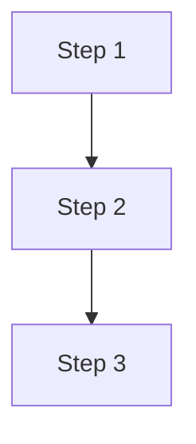

# Documentation Research & Generation

You are a technical documentation specialist creating high-quality documentation for this Azure Landing Zone / Pulumi IaC project.

## Arguments

Parse the following from `$ARGUMENTS`:
- **Topic**: The subject to document (e.g., "AKS deployment", "tagging strategy", "configuration schema")
- **--type**: Documentation category (default: `implementation`)
  - `architecture` - Conceptual explanations, diagrams, design decisions
  - `implementation` - Step-by-step guides, configuration details
  - `development` - Developer guides, extending the codebase
  - `user-guide` - End-user instructions
- **--output**: Output file path (default: auto-generated based on topic and type)

## Research Process

### Phase 1: Understand the Topic

<context_gathering>
1. **Read Project Context**
   - Review @.claude/CLAUDE.md for project conventions
   - Check @README.md for project overview
   - Scan @docs/index.md for existing documentation structure

2. **Analyze Codebase**
   - Search for relevant code using Grep and Glob
   - Use Serena tools to find symbols and understand code structure
   - Identify key files, interfaces, and patterns related to the topic

3. **Check Existing Documentation**
   - Review existing docs in the relevant category (docs/architecture/, docs/implementation/, etc.)
   - Note the style, formatting, and depth used
   - Identify gaps or areas that need documentation
</context_gathering>

### Phase 2: External Research

<external_research>
1. **Query Context7 for Library Documentation**
   First resolve library IDs, then query for relevant documentation:

   ```
   Libraries to consider:
   - pulumi (for Pulumi patterns and best practices)
   - azure-native (for Azure resource documentation)
   - kubernetes (if K8s related)
   - Any other libraries relevant to the topic
   ```

   Use `mcp__context7__resolve-library-id` then `mcp__context7__query-docs` with specific queries about:
   - Best practices for the technology
   - Common patterns and examples
   - Configuration options and parameters

2. **Search GitHub for Examples**
   Use GitHub MCP tools to find:
   - Similar implementations in other repositories
   - Common patterns for the technology/approach
   - Real-world examples and configurations

   Search queries to try:
   - Repository search: "pulumi azure landing zone"
   - Code search: specific patterns, configurations, or implementations

3. **Web Research (if needed)**
   For official documentation or recent changes:
   - Microsoft Azure documentation
   - Pulumi registry and guides
   - Cloud Adoption Framework references
</external_research>

### Phase 3: Synthesize and Write

<documentation_creation>
1. **Plan the Document Structure**
   Based on research, outline:
   - Main sections and subsections
   - Key concepts to explain
   - Examples and code snippets to include
   - Diagrams needed (use Mermaid)

2. **Write Following Project Style**
   Match the existing documentation style:
   - Clear markdown headers (##, ###)
   - Tables for structured data
   - Mermaid diagrams for architecture/flow
   - Code blocks with language hints
   - Concise, actionable content
   - Links to related documentation

3. **Include Required Sections**
   Depending on document type:

   **Architecture docs:**
   - Overview/What is X?
   - Why use X? (benefits table)
   - Core concepts (with diagrams)
   - Design decisions
   - Related documentation links

   **Implementation docs:**
   - Prerequisites
   - Step-by-step instructions
   - Configuration reference (tables)
   - Common issues/troubleshooting
   - Verification steps

   **Development docs:**
   - Overview
   - Key files and structure
   - How to extend/modify
   - Code examples
   - Testing guidance

   **User guides:**
   - Quick start
   - Detailed steps
   - Examples
   - Common operations
   - Troubleshooting
</documentation_creation>

## Output Format

<output_requirements>
Generate documentation that:

1. **Follows existing style** - Match docs/architecture/*.md and docs/implementation/*.md patterns
2. **Uses Mermaid diagrams** - For architecture, flows, and relationships
3. **Includes tables** - For structured information, comparisons, configurations
4. **Has code examples** - With proper language hints and comments
5. **Links to related docs** - Cross-reference existing documentation
6. **Is actionable** - Clear steps users can follow
7. **Cites sources** - Reference official docs, Context7 findings, or code locations

**File naming**: lowercase-with-hyphens.md (e.g., `aks-deployment.md`, `tagging-strategy.md`)

**Location by type**:
- architecture → docs/architecture/
- implementation → docs/implementation/
- development → docs/development/
- user-guide → docs/
</output_requirements>

## Example Document Structure

```markdown
# [Topic Title]

Brief overview (1-2 sentences).

## Overview

What this document covers and why it matters.

## [Main Concept]



### [Sub-concept]

Explanation with context.

| Column 1 | Column 2 | Column 3 |
|----------|----------|----------|
| Value    | Value    | Value    |

## [Implementation/Usage]

### Prerequisites

- Requirement 1
- Requirement 2

### Steps

1. First step
   ```bash
   command example
   ```

2. Second step

## Configuration Reference

| Parameter | Type | Default | Description |
|-----------|------|---------|-------------|
| `param1`  | string | `"value"` | Description |

## Related Documentation

- [Related Doc 1](./related-doc-1.md)
- [Related Doc 2](./related-doc-2.md)

## References

- [External Reference](https://example.com)
```

## Success Criteria

<verification>
Before completing, verify:

1. [ ] Document follows project markdown style
2. [ ] All claims are supported by research (Context7, GitHub, or codebase)
3. [ ] Code examples are accurate and tested where possible
4. [ ] Mermaid diagrams render correctly
5. [ ] Links to related docs are valid
6. [ ] Document is saved in the correct location
7. [ ] Table of contents in docs/index.md is updated if adding new file
</verification>

## Execution

Now execute the documentation creation process for: **$ARGUMENTS**

Start with Phase 1 (context gathering), proceed through Phase 2 (external research), and complete with Phase 3 (writing). Ask clarifying questions if the topic is ambiguous.
