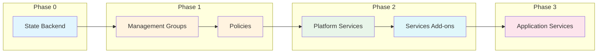
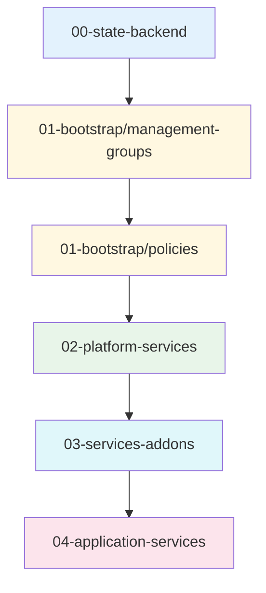

# Azure Landing Zone - Pulumi Enterprise Platform

A production-ready, multi-tenant Azure Landing Zone using Pulumi TypeScript, following Microsoft's Cloud Adoption Framework.

## Features

- **Azure Landing Zone Architecture** - Management groups, policies, and governance
- **Multi-Tenant Support** - Isolated resources per tenant with shared platform
- **Zero-Trust Security** - Private endpoints, workload identity, NSG policies
- **Infrastructure as Code** - Fully automated with Pulumi TypeScript

## Architecture

### Deployment Flow

The deployment follows a sequential phase-based approach:



### Phase Summary

| Phase | Stack | Purpose | Dependencies |
|-------|-------|---------|--------------|
| 0 | `00-state-backend` | Pulumi state storage | None |
| 1a | `01-bootstrap/management-groups` | Management group hierarchy | Phase 0 |
| 1b | `01-bootstrap/policies` | Azure Policy assignments | Phase 1a |
| 2 | `02-platform-services` | Shared infrastructure (AKS, SQL, VNet) | Phase 1 |
| 2.5 | `03-services-addons` | Kubernetes add-ons (Grafana, Kyverno) | Phase 2 |
| 3 | `04-application-services` | Per-tenant resources | Phase 2.5 |

## Project Structure

```
pulumi-cloud-native-enterprise-platform/
├── packages/
│   └── core/                          # Shared TypeScript library
│       └── lib/
│           ├── naming.ts              # Resource naming functions
│           ├── tagging.ts             # Tagging functions
│           ├── interfaces.ts          # Type definitions
│           └── config/                # Configuration loader
│
├── stacks/                            # Pulumi stacks (deployable units)
│   ├── 00-state-backend/              # Phase 0: State storage
│   ├── 01-bootstrap/                  # Phase 1: Bootstrap
│   │   ├── management-groups/         # Management group hierarchy
│   │   └── policies/                  # Azure Policy assignments
│   ├── 02-platform-services/          # Phase 2: Platform infrastructure
│   ├── 03-services-addons/            # Phase 2.5: Kubernetes add-ons
│   └── 04-application-services/       # Phase 3: Tenant resources
│
├── config/                            # Configuration files
│   └── examples/                      # Configuration templates
├── scripts/                           # Automation scripts
└── docs/                              # Documentation
```

### Stack Dependencies



## Prerequisites

### Required Tools

| Tool | Version | Installation |
|------|---------|--------------|
| Node.js | >= 18 | [nodejs.org](https://nodejs.org) |
| pnpm | >= 8 | `npm install -g pnpm` |
| Pulumi CLI | >= 3 | [pulumi.com/docs/install](https://www.pulumi.com/docs/install/) |
| Azure CLI | >= 2.50 | [docs.microsoft.com](https://docs.microsoft.com/cli/azure/install-azure-cli) |

### Azure Permissions

| Phase | Required Role |
|-------|--------------|
| 0 (State) | Contributor on subscription |
| 1 (Bootstrap) | Management Group Contributor at tenant root |
| 2 (Platform) | Owner on platform subscription |
| 3 (Application) | Contributor on workload subscription |

### Verify Prerequisites

```bash
# Check Node.js
node --version    # >= 18

# Check pnpm
pnpm --version    # >= 8

# Check Pulumi
pulumi version    # >= 3

# Check Azure CLI and login
az --version
az login
az account show
```

## State Management Strategy

This project uses a **two-tier state management** approach:

```
┌─────────────────────────────────────────────────────────────────┐
│  LOCAL STATE (Phase 0 only)         AZURE BLOB (Phase 1+)      │
│  ~/.pulumi-local/                   Azure Storage Account       │
│  └── 00-state-backend state         └── All other stacks       │
│                                                                 │
│  Phase 0 creates ──────────────────► Azure Blob Backend        │
│  (bootstrap)                         (production state)         │
└─────────────────────────────────────────────────────────────────┘
```

**Why?** Phase 0 creates the Azure Storage Account for state. We can't store Phase 0's state in storage that doesn't exist yet (chicken-and-egg problem). After Phase 0, all other phases use Azure Blob.

> **Important:** Backup your local state directory (`~/.pulumi-local/`) - it's your bootstrap recovery key.

## Quick Start (Script-Based - Recommended)

The recommended way to deploy the landing zone is using the automation scripts. These scripts handle state management switching automatically.

### 1. Prerequisites

```bash
# Check and install prerequisites
./scripts/00-prerequisites/check-prerequisites.sh

# Or install missing tools automatically
./scripts/00-prerequisites/install-tools.sh

# Login to Azure
./scripts/00-prerequisites/azure-login.sh
# Or: az login
```

### 2. Clone and Setup

```bash
# Clone repository
git clone <repository-url>
cd pulumi-cloud-native-enterprise-platform

# Install dependencies
pnpm install

# Build all packages
pnpm -r build
```

### 3. Configure Subscriptions

```bash
# Interactive subscription setup (validates IDs, registers providers)
./scripts/01-azure-setup/create-subscriptions-payg.sh

# Or manually create config
cp config/examples/minimal-payg-single.yaml config/landing-zone.yaml
# Edit config/landing-zone.yaml with your subscription ID
```

> **Note:** PAYG subscriptions must be created via Azure Portal. This is an Azure platform limitation. See [Subscription Setup](#subscription-setup) for details.

### 4. Deploy Everything

```bash
# Deploy all phases (including Phase 0)
./scripts/02-state-management/deploy-all.sh --include-phase0

# Or deploy in steps:
./scripts/02-state-management/deploy-phase0.sh                  # Phase 0: State backend
./scripts/02-state-management/switch-to-azure-state.sh         # Switch to Azure Blob
./scripts/02-state-management/deploy-all.sh                    # Phases 1-3
```

### 5. Verify Deployment

```bash
# Check current Pulumi backend
pulumi whoami -v

# List deployed stacks
pulumi stack ls
```

## Manual Deployment (Alternative)

If you prefer manual control over each step, follow this guide.

### 1. Prerequisites

```bash
# Create Azure account (if you don't have one)
# https://azure.microsoft.com/free/

# Login to Azure
az login
az account show  # Note your subscription ID
```

### 2. Create Configuration

```bash
# Copy example configuration
cp config/examples/minimal-payg-single.yaml config/landing-zone.yaml

# Edit with your values (use your subscription ID from step 1)
# - platform.organization.name: your-org-name
# - platform.billing.subscriptions.management: your-subscription-id
# - platform.region.primary: eastus (or your preferred region)
```

### 3. Deploy Phase 0: State Backend (Local State)

```bash
# Create local state directory
mkdir -p ~/.pulumi-local

# Login to local state (for Phase 0 only)
pulumi login file://~/.pulumi-local

# Deploy state backend
cd stacks/00-state-backend
pulumi stack init dev-eastus
pulumi config set azure-native:location eastus
pulumi up  # Creates Azure Storage Account

# Save storage account info for next step
pulumi stack output storageAccountName
pulumi stack output containerName
```

### 4. Switch to Azure Blob State (Phase 1+)

```bash
# Get storage account details
export STORAGE_ACCOUNT=$(pulumi stack output storageAccountName)
export CONTAINER_NAME=$(pulumi stack output containerName)

# Get storage account key
export AZURE_STORAGE_KEY=$(az storage account keys list \
  --account-name $STORAGE_ACCOUNT \
  --query '[0].value' -o tsv)

# Switch Pulumi to use Azure Blob backend
cd ..  # Back to stacks/
pulumi logout
pulumi login azblob://${STORAGE_ACCOUNT}/${CONTAINER_NAME}
```

### 5. Deploy Remaining Phases (Azure Blob State)

```bash
# Phase 1a: Management Groups
cd 01-bootstrap/management-groups
pulumi stack init bootstrap
pulumi up

# Phase 1b: Policies
cd ../policies
pulumi stack init bootstrap-policies
pulumi up

# Phase 2: Platform Services
cd ../../02-platform-services
pulumi stack init dev-eastus
pulumi config set azure-native:location eastus
pulumi config set infrastructure:environment dev
pulumi config set --secret sql:adminPassword <your-secure-password>
pulumi up

# Phase 2.5: Services Add-ons
cd ../03-services-addons
pulumi stack init dev-eastus
pulumi config set infrastructure:environment dev
pulumi config set infrastructure:location eastus
pulumi up

# Phase 3: Application Services (per tenant)
cd ../04-application-services
pulumi stack init acme-prod-eastus
pulumi config set azure-native:location eastus
pulumi config set infrastructure:tenantId acme
pulumi config set infrastructure:environment prod
pulumi up
```

## Subscription Setup

### PAYG (Pay-As-You-Go)

Azure CLI cannot create PAYG subscriptions programmatically. This is an Azure platform limitation.

**To create a PAYG subscription:**
1. Go to [Azure Portal Subscriptions](https://portal.azure.com/#view/Microsoft_Azure_Billing/SubscriptionsBlade)
2. Click **+ Add**
3. Select **Pay-As-You-Go**
4. Complete the wizard

After creating subscriptions, use the setup script to validate and configure:
```bash
./scripts/01-azure-setup/create-subscriptions-payg.sh
```

### Enterprise Agreement (EA) / Microsoft Customer Agreement (MCA)

EA/MCA subscriptions can be created programmatically. Contact your Azure administrator for billing account access.

## Configuration

Example configuration (`config/landing-zone.yaml`):

```yaml
platform:
  organization:
    name: contoso
    displayName: Contoso Corp

  billing:
    model: PAYG
    subscriptions:
      management: "xxxxxxxx-xxxx-xxxx-xxxx-xxxxxxxxxxxx"
      connectivity: "xxxxxxxx-xxxx-xxxx-xxxx-xxxxxxxxxxxx"

  region:
    mode: single
    primary: eastus

workloads:
  defaults:
    computeType: aks
    tier: corp
```

## Common Operations

### Add a New Tenant

```bash
cd stacks/04-application-services
pulumi stack init newtenant-prod-eastus
pulumi config set infrastructure:tenantId newtenant
pulumi config set infrastructure:environment prod
pulumi up
```

### Update Platform

```bash
cd stacks/02-platform-services
pulumi stack select dev-eastus
pulumi up
```

### Destroy Resources

Using scripts (recommended):
```bash
# Destroy all phases except Phase 0
./scripts/02-state-management/destroy-all.sh

# Destroy everything including Phase 0
./scripts/02-state-management/destroy-all.sh --include-phase0

# Destroy specific phase
./scripts/02-state-management/destroy-all.sh --phase workloads
```

Manual destruction (reverse order):
```bash
# Destroy Phase 1-3 (using Azure Blob state)
cd stacks/04-application-services && pulumi destroy --yes
cd ../03-services-addons && pulumi destroy --yes
cd ../02-platform-services && pulumi destroy --yes
cd ../01-bootstrap/policies && pulumi destroy --yes
cd ../management-groups && pulumi destroy --yes

# Switch back to local state for Phase 0
pulumi logout
pulumi login file://~/.pulumi-local

# Destroy Phase 0 (state backend itself)
cd ../../00-state-backend && pulumi destroy --yes
```

## Documentation

| Document | Description |
|----------|-------------|
| **[User Guide](docs/user-guide.md)** | Complete step-by-step deployment guide |
| [Documentation Index](docs/index.md) | All documentation |
| [Architecture](docs/architecture/index.md) | Landing zone concepts |
| [Implementation](docs/implementation/index.md) | Deployment guides |
| [Development](docs/development/index.md) | Developer guide |

## References

- [Azure Landing Zones](https://learn.microsoft.com/azure/cloud-adoption-framework/ready/landing-zone/)
- [Pulumi Azure Native](https://www.pulumi.com/registry/packages/azure-native/)
- [Azure Naming Conventions](https://learn.microsoft.com/azure/cloud-adoption-framework/ready/azure-best-practices/resource-abbreviations)

## License

MIT
