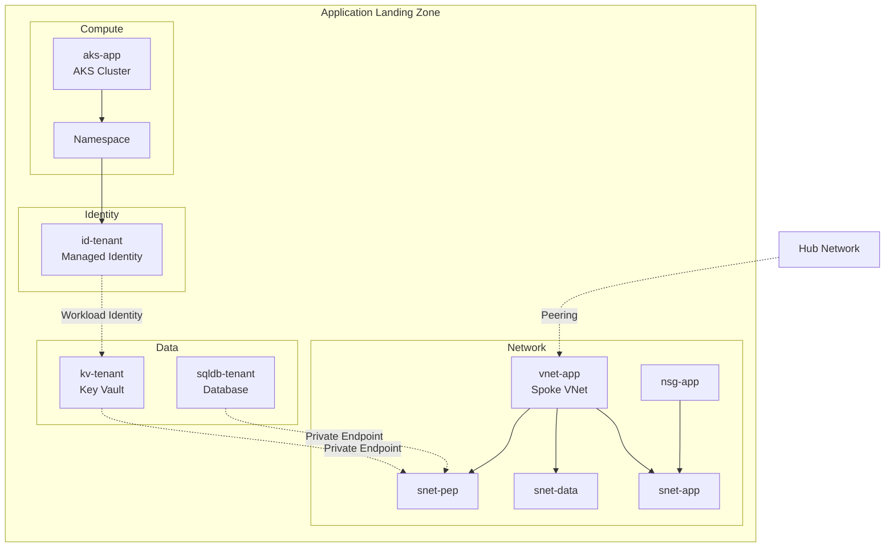
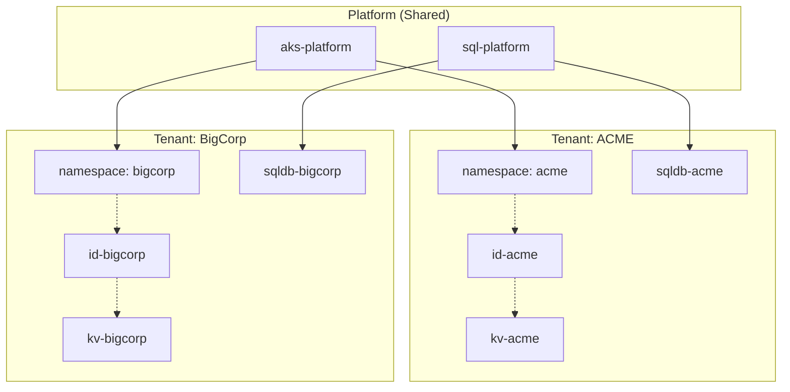
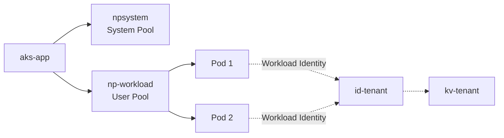
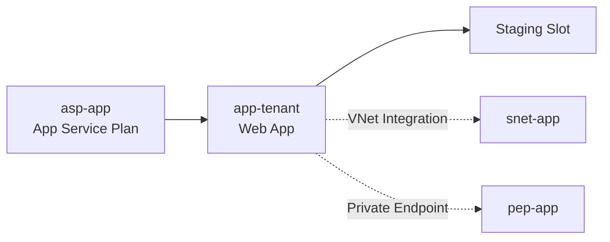
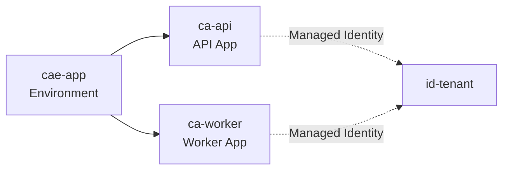
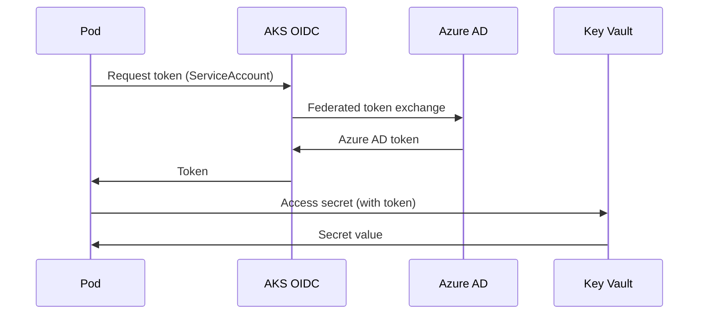

# Application Landing Zone

Where your workloads run with per-tenant isolation.

## Architecture



## Tenant Isolation

### Multi-Tenancy Model



| Layer | Tenant Scope | Isolation |
|-------|--------------|-----------|
| Platform | Shared | All tenants use same AKS, SQL Server |
| Services | Shared | Cluster add-ons serve all tenants |
| Application | Per-Tenant | Separate database, Key Vault, namespace |

### Database Isolation Options

| Mode | Description | Use Case |
|------|-------------|----------|
| `isolated` | Separate database per tenant | High security, compliance |
| `shared` | Same database with RLS | Cost optimization |

## Compute Types

### AKS (Default)



**Resources Created:**
| Resource | Abbreviation |
|----------|--------------|
| AKS Cluster | `aks` |
| System Node Pool | `npsystem` |
| User Node Pool | `np` |
| Managed Identity | `id` |

### App Service



**Resources Created:**
| Resource | Abbreviation |
|----------|--------------|
| App Service Plan | `asp` |
| Web App | `app` |
| Function App | `func` |

### Container Apps



**Resources Created:**
| Resource | Abbreviation |
|----------|--------------|
| Container Apps Environment | `cae` |
| Container App | `ca` |

## Workload Identity

Zero-trust pod-to-Azure authentication without secrets.



**Setup:**
1. AKS cluster with OIDC issuer enabled
2. Managed Identity (`id-tenant`)
3. Federated credential linking K8s SA to Azure AD
4. Pod uses `DefaultAzureCredential()` - no secrets in code!

## Naming Examples

```
# Tenant: ACME, Environment: prod, Region: eastus

rg-app-acme-prod-eastus          # Resource Group
vnet-app-acme-prod-eastus        # Virtual Network
snet-app                          # Subnet (app tier)
snet-data                         # Subnet (data tier)
snet-pep                          # Subnet (private endpoints)
nsg-app-acme-prod-eastus         # Network Security Group
aks-acme-prod-eastus             # AKS Cluster
kv-acme-prod-eastus              # Key Vault (24 char max!)
sqldb-acme-prod                   # SQL Database
id-acme-prod-eastus              # Managed Identity
pep-kv-acme                       # Private Endpoint for KV
```

## Configuration

```yaml
workloads:
  applications:
    - name: acme
      tier: corp                     # corp | online | sandbox
      computeType: aks               # aks | appservice | container-apps

      network:
        addressSpace: "10.10.0.0/16"

      aks:
        kubernetesVersion: "1.28"
        enableWorkloadIdentity: true
        enablePrivateCluster: true

      database:
        enabled: true
        type: postgresql
        isolation: isolated          # isolated | shared

      keyVault:
        enabled: true
```

## Related

- [Connectivity Patterns](./connectivity-patterns.md)
- [Workload Deployment Guide](../implementation/workload-deployment.md)
