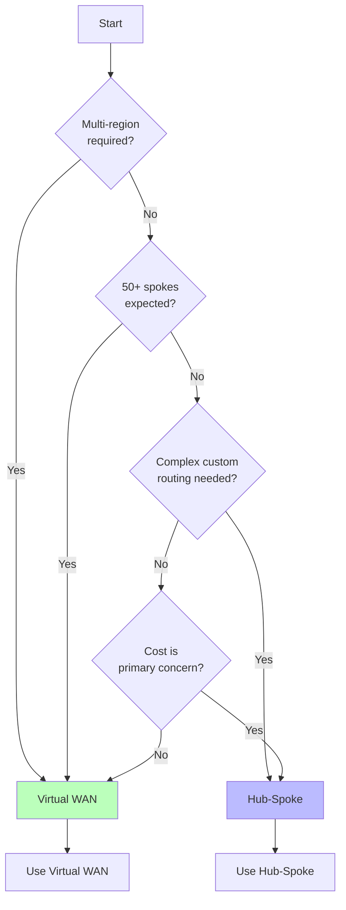
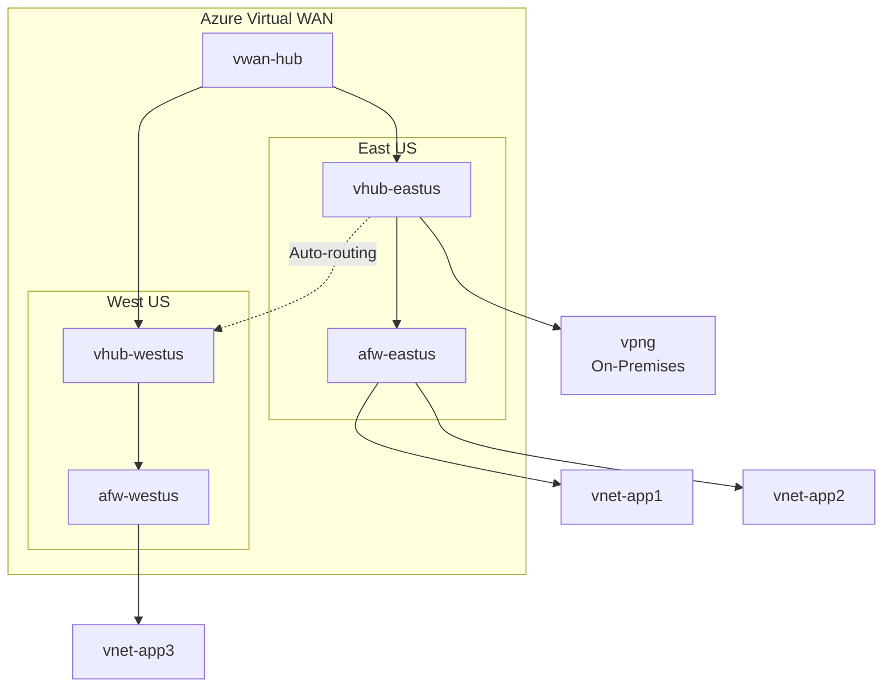
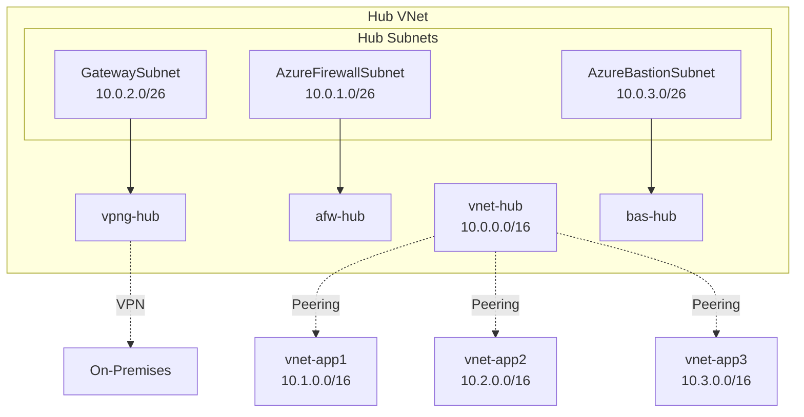
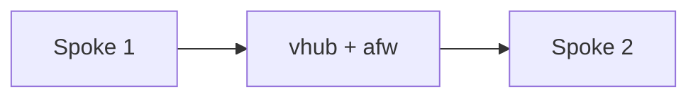
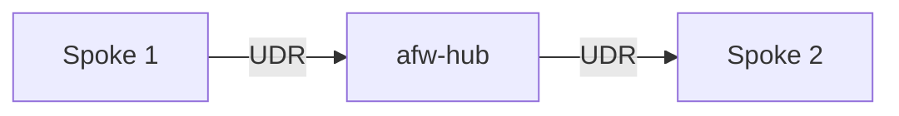
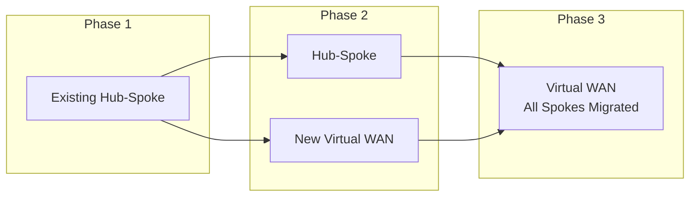

# Connectivity Patterns

Comparison of Virtual WAN and Hub-Spoke architectures.

## Decision Flowchart



## Comparison Matrix

| Aspect | Virtual WAN | Hub-Spoke |
|--------|-------------|-----------|
| Complexity | Lower (managed) | Higher (self-managed) |
| Cost | Higher base | Lower base |
| Scale | Better at scale | Manual scaling |
| Routing | Automatic | Manual (UDRs) |
| Multi-region | Built-in | Manual setup |
| Customization | Limited | Full control |

## Virtual WAN (Default)



### Resources Created

| Resource | Abbreviation | Purpose |
|----------|--------------|---------|
| Virtual WAN | `vwan` | Parent container |
| Virtual Hub | `vhub` | Regional hub |
| Azure Firewall | `afw` | Secured hub |
| VPN Gateway | `vpng` | S2S VPN |
| ExpressRoute Gateway | `ergw` | Private WAN |

### When to Use

- Large enterprise (50+ spokes)
- Multi-region deployment
- Need automatic spoke-to-spoke routing
- Prefer managed service

### Configuration

```yaml
platform:
  connectivity:
    architecture: vwan
    vwan:
      sku: Standard
      allowBranchToBranch: true
    firewall:
      enabled: true
      sku: Standard
```

## Hub-Spoke



### Resources Created

| Resource | Abbreviation | Purpose |
|----------|--------------|---------|
| Virtual Network | `vnet` | Hub network |
| Subnet | `snet` | Network segment |
| Azure Firewall | `afw` | Traffic inspection |
| VPN Gateway | `vpng` | S2S VPN |
| Azure Bastion | `bas` | Secure RDP/SSH |
| Route Table | `rt` | Custom routing |
| User Defined Route | `udr` | Route entry |

### When to Use

- Smaller deployments (<50 spokes)
- Need full routing control
- Cost-sensitive workloads
- Custom NVA requirements

### Configuration

```yaml
platform:
  connectivity:
    architecture: hub-spoke
    hub:
      addressSpace: "10.0.0.0/16"
      subnets:
        firewall: "10.0.1.0/26"
        gateway: "10.0.2.0/26"
        bastion: "10.0.3.0/26"
    firewall:
      enabled: true
      sku: Standard
```

## Spoke-to-Spoke Traffic

### Virtual WAN
Traffic flows automatically through the secured hub:



### Hub-Spoke
Requires UDRs to force traffic through firewall:



## Firewall SKUs

| SKU | Features | Cost |
|-----|----------|------|
| Standard | Basic filtering, threat intel, FQDN | Lower |
| Premium | TLS inspection, IDPS, URL categories | Higher |

```yaml
platform:
  connectivity:
    firewall:
      enabled: true
      sku: Standard              # Standard | Premium
      threatIntelMode: Alert     # Off | Alert | Deny
      dnsProxy: true
```

## Migration Path

Can migrate from Hub-Spoke to Virtual WAN later:



## Related

- [Multi-Region Design](./multi-region-design.md)
- [Platform Landing Zone](./platform-landing-zone.md)
