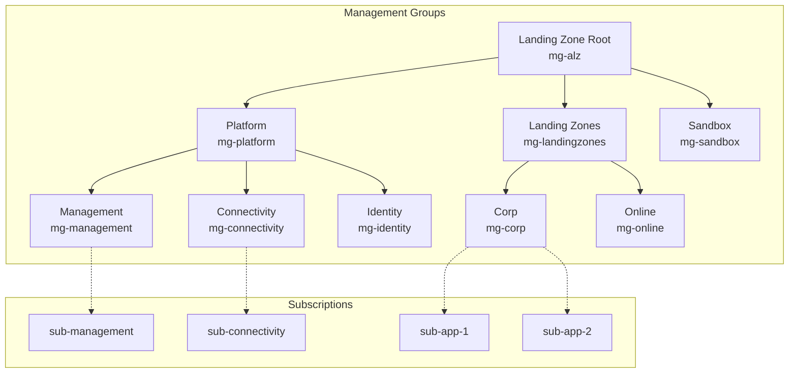
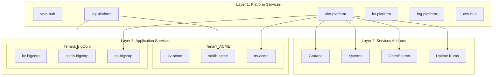
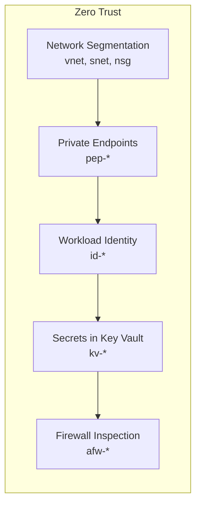

# Architecture

Multi-tenant, multi-region, zero-trust cloud infrastructure architecture.

## High-Level Architecture

## Contents

| Document | Description |
|----------|-------------|
| [Landing Zone Concepts](./landing-zone-concepts.md) | What is a landing zone, why use it |
| [Platform Landing Zone](./platform-landing-zone.md) | Shared infrastructure components |
| [Application Landing Zone](./application-landing-zone.md) | Workload-specific environments |
| [Connectivity Patterns](./connectivity-patterns.md) | Virtual WAN vs Hub-Spoke |
| [Multi-Region Design](./multi-region-design.md) | Single vs multi-region deployment |

## Three-Layer Architecture

## Key Design Decisions

| Decision | Choice | Rationale |
|----------|--------|-----------|
| Connectivity | Virtual WAN (default) | Simpler at scale, automatic routing |
| Compute | AKS (default) | Cloud-native, Kubernetes ecosystem |
| Billing | PAYG (default) | Safest for getting started |
| Region | Single (default) | Simpler initial deployment |
| State Backend | Azure Blob | Full control, compliance ready |

## Security: Zero-Trust Principles

1. **Network Segmentation**: Separate subnets for app, data, system
2. **Private Endpoints**: No public endpoints for PaaS services
3. **Workload Identity**: Pod-to-Azure auth without secrets
4. **Key Vault**: All secrets managed centrally
5. **Firewall**: Centralized traffic inspection
