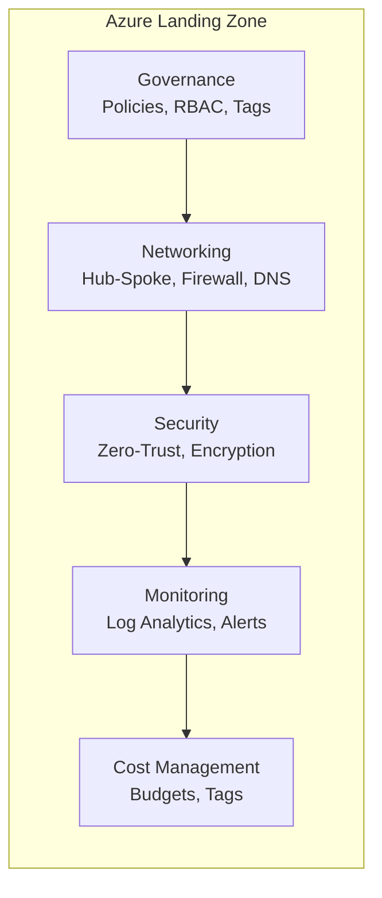
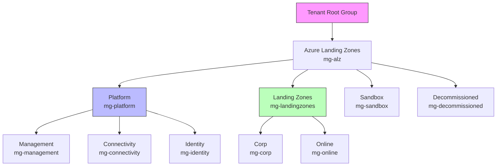
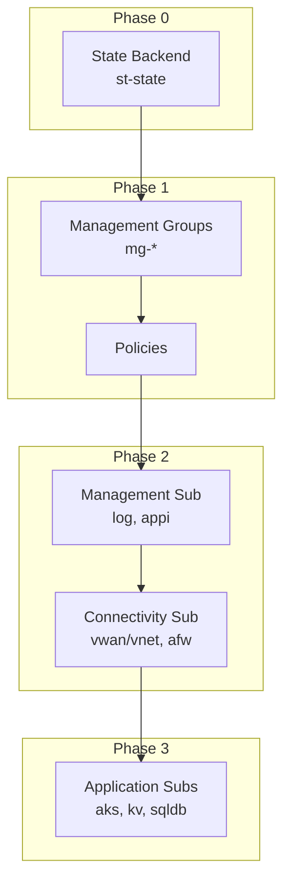

# Landing Zone Concepts

## What is an Azure Landing Zone?

An Azure Landing Zone is a pre-configured, secure, scalable environment that follows Microsoft's best practices.

## Why Use Landing Zones?

| Benefit | Description |
|---------|-------------|
| Governance | Consistent policies across all workloads |
| Security | Security baseline applied from day one |
| Scalability | Designed to grow with your organization |
| Compliance | Built-in compliance controls |
| Cost Management | Clear cost boundaries via subscriptions |

## Core Components

### Management Groups Hierarchy

## Two Types of Landing Zones

### Platform Landing Zone
Shared services used by ALL applications.

| Component | Subscription | Resources |
|-----------|--------------|-----------|
| Management | sub-management | log, appi, aa |
| Connectivity | sub-connectivity | vnet/vwan, afw, vpng |
| Identity | sub-identity | Azure AD DS (optional) |

### Application Landing Zone
Where your workloads run.

| Type | Use Case | Example Resources |
|------|----------|-------------------|
| Corp | Internal apps | aks, kv, sqldb, pep |
| Online | Public-facing | app, agw, afd |
| Sandbox | Dev/test | vm, vnet |

## Deployment Order

**Order matters due to dependencies:**
1. **State Backend** → Store Pulumi state securely
2. **Management Groups** → Empty containers first
3. **Policies** → Governance rules
4. **Management Sub** → Logging (everything logs here)
5. **Connectivity Sub** → Hub network (everything connects here)
6. **Application Subs** → Your applications (as needed)

## Key Principles

1. **Subscription democratization** - Each team/app gets isolated subscription
2. **Policy-driven governance** - Enforce standards via policy, not manual review
3. **Single control plane** - Manage everything through Azure Resource Manager
4. **Application-centric** - Focus on applications, not infrastructure

## Related

- [Platform Landing Zone](./platform-landing-zone.md)
- [Application Landing Zone](./application-landing-zone.md)
