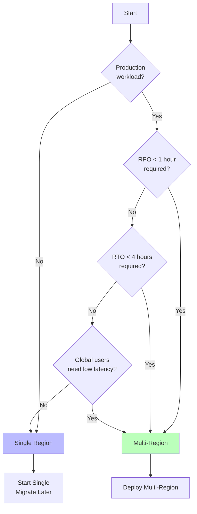
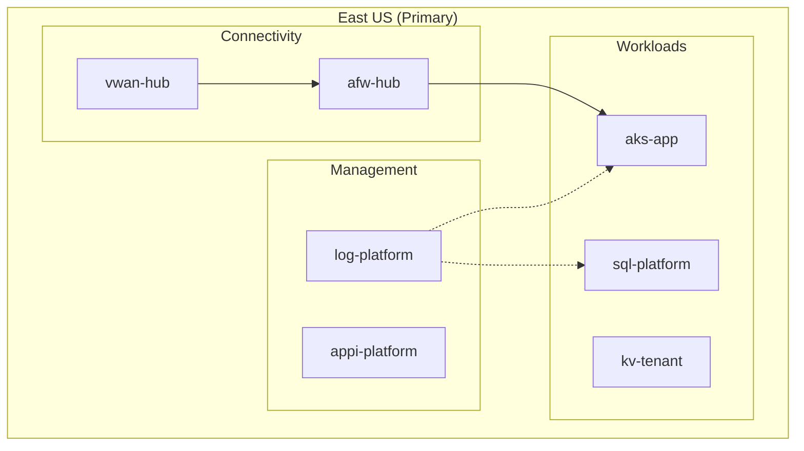
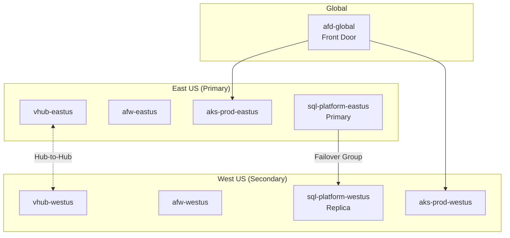
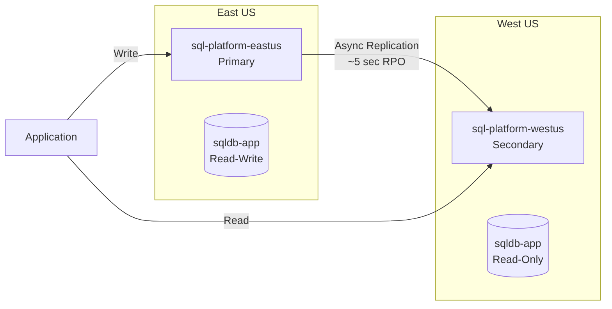
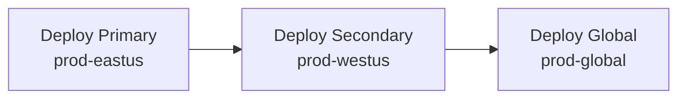

# Multi-Region Design

Single vs multi-region deployment patterns.

## Decision Flowchart



## Comparison

| Aspect | Single Region | Multi-Region |
|--------|---------------|--------------|
| Complexity | Lower | Higher |
| Cost | ~1x | ~2x |
| Availability | 99.9-99.99% | 99.99-99.999% |
| DR | Limited | Built-in |
| Latency | Single point | Geo-distributed |

## Single Region (Default)



### When to Use

- Getting started / MVP
- Cost-sensitive deployments
- No geo-redundancy requirements
- Regional compliance requirements
- Development/staging environments

### Configuration

```yaml
platform:
  region:
    mode: single
    primary: eastus
```

## Multi-Region



### When to Use

- Production requiring high availability
- Global user base needing low latency
- Business continuity requirements
- Compliance requiring geo-redundancy

### Configuration

```yaml
platform:
  region:
    mode: multi
    primary: eastus
    secondary: westus
```

## Data Replication

### SQL Server Failover Groups



### Replication Strategies

| Strategy | Description | Use Case |
|----------|-------------|----------|
| Active-Active | Both regions serve traffic | Low latency globally |
| Active-Passive | Secondary is hot standby | Cost optimization |
| Active-Cold | Secondary is minimal | Dev/test |

## Deployment Strategy

### Single Region
```bash
pulumi up --stack prod-eastus
```

### Multi-Region



```bash
# 1. Deploy primary
pulumi up --stack prod-eastus

# 2. Deploy secondary (references primary)
pulumi up --stack prod-westus

# 3. Deploy global services
pulumi up --stack prod-global
```

## Cost Considerations

| Component | Single | Multi (estimate) |
|-----------|--------|------------------|
| Compute | 1x | 2x |
| Networking | 1x | 2x + cross-region |
| Storage | 1x | 2x (or GRS) |
| Database | 1x | 2x (or geo-replica) |
| Monitoring | 1x | 1.5x |

## Disaster Recovery Tiers

| Tier | Configuration | RPO | RTO |
|------|---------------|-----|-----|
| High | Active-Passive + Auto-failover | ~5 sec | <1 min |
| Medium | Active-Passive + Manual | ~5 sec | ~5-10 min |
| Low | Single region + Backups | 24 hr | 1-4 hr |

```yaml
platform:
  region:
    mode: multi
    primary: eastus
    secondary: westus

  database:
    redundancyLevel: high      # high | medium | low
```

## Related

- [Connectivity Patterns](./connectivity-patterns.md)
- [Platform Landing Zone](./platform-landing-zone.md)
