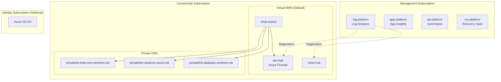
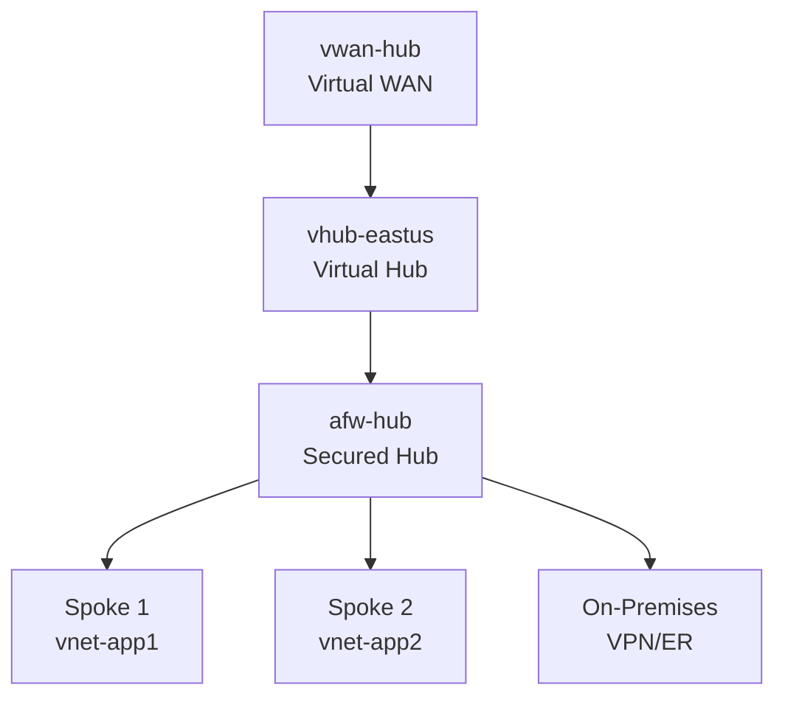
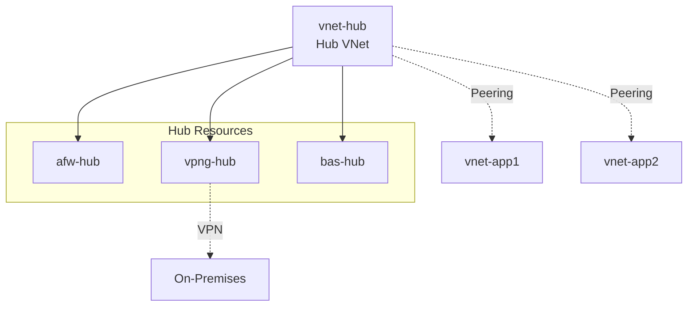
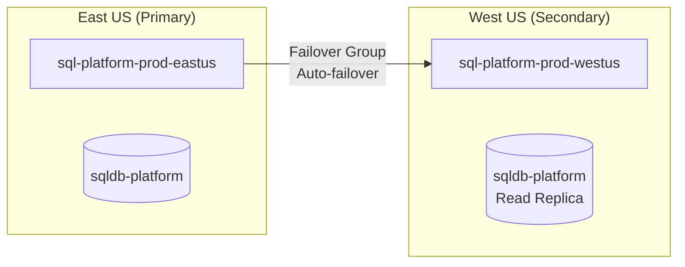

# Platform Landing Zone

Shared infrastructure that all applications consume.

## Architecture



## Management Subscription

**Purpose**: Centralized monitoring and management.

### Resources Created

| Resource | Abbreviation | Purpose |
|----------|--------------|---------|
| Log Analytics Workspace | `log` | Central log aggregation |
| Application Insights | `appi` | Application performance monitoring |
| Automation Account | `aa` | Runbooks, DSC, Update Management |
| Recovery Services Vault | `rsv` | Backup and disaster recovery |
| Action Group | `ag` | Alert notifications |

### Naming Examples
```
log-platform-prod-eastus
appi-platform-prod-eastus
aa-platform-prod-eastus
rsv-platform-prod-eastus
```

## Connectivity Subscription

**Purpose**: Network hub connecting all spokes.

### Virtual WAN Architecture (Default)



### Hub-Spoke Architecture (Alternative)



### Resources Created

| Resource | Abbreviation | Purpose |
|----------|--------------|---------|
| Virtual WAN | `vwan` | Parent container |
| Virtual Hub | `vhub` | Regional routing hub |
| Azure Firewall | `afw` | Traffic inspection |
| VPN Gateway | `vpng` | Site-to-site VPN |
| ExpressRoute Gateway | `ergw` | Private WAN |
| Private DNS Zone | - | Private endpoint DNS |

### Naming Examples
```
vwan-hub-prod
vhub-prod-eastus
afw-hub-prod-eastus
vpng-hub-prod-eastus
```

## Disaster Recovery

### Database Failover (SQL Server)



| Level | Configuration | RPO | RTO |
|-------|---------------|-----|-----|
| High (prod) | Active-Passive + Auto-failover | ~5 sec | <1 min |
| Medium (staging) | Active-Passive + Manual | ~5 sec | ~5-10 min |
| Low (dev) | Single region + Backups | 24 hr | 1-4 hr |

## Configuration

```yaml
platform:
  management:
    logRetentionDays: 30
    enableDefender: true

  connectivity:
    architecture: vwan           # vwan | hub-spoke
    firewall:
      enabled: true
      sku: Standard              # Standard | Premium

  identity:
    enabled: false               # Enable identity subscription
```

## Related

- [Connectivity Patterns](./connectivity-patterns.md)
- [Multi-Region Design](./multi-region-design.md)
