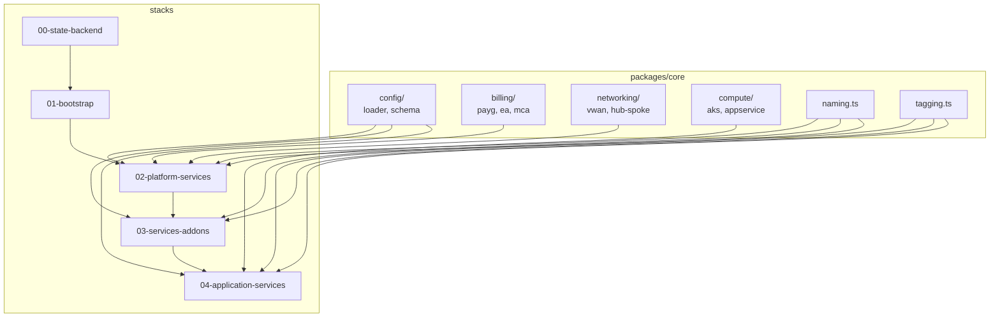
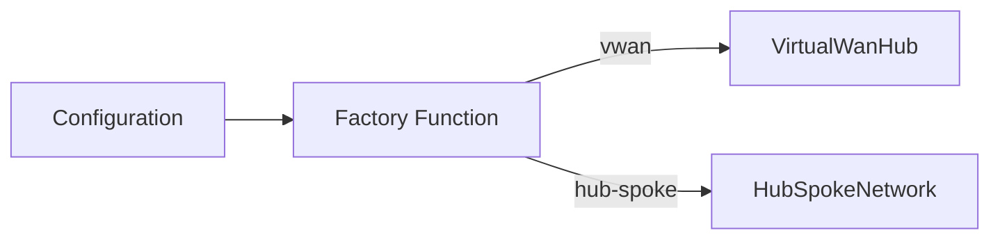

# Development Guide

Guide for developers extending and maintaining this platform.

## Contents

| Document | Description |
|----------|-------------|
| [Project Structure](./project-structure.md) | Codebase organization |
| [Naming Conventions](./naming-conventions.md) | Azure resource naming |
| [Adding New Workload](./adding-new-workload.md) | Create new application landing zone |
| [Extending Components](./extending-components.md) | Add new resource types |
| [Testing Guide](./testing-guide.md) | Testing strategies |

## Quick Reference

### Build
```bash
pnpm install                       # Install dependencies
pnpm -r build                      # Build all packages
```

### Deploy
```bash
cd stacks/<stack-name>
pulumi preview                     # Preview changes
pulumi up                          # Deploy
```

### Test
```bash
pnpm -r test                       # Run all tests
```

## Architecture Overview



## Key Patterns

### ComponentResource Pattern

All reusable infrastructure as Pulumi ComponentResources:

```typescript
export class MyComponent extends pulumi.ComponentResource {
  public readonly output: pulumi.Output<string>;

  constructor(name: string, args: MyArgs, opts?: pulumi.ComponentResourceOptions) {
    super("enterprise:infrastructure:MyComponent", name, args, opts);

    const resource = new azure.Resource(`${name}-resource`, {
      ...
    }, { parent: this });

    this.output = resource.id;
    this.registerOutputs({ output: this.output });
  }
}
```

### Configuration-Driven

All behavior controlled by configuration:

```typescript
const config = loadLandingZoneConfig();

if (config.platform.connectivity.architecture === "vwan") {
  new VirtualWanHub(...);
} else {
  new HubSpokeNetwork(...);
}
```

### Stack References

Share outputs between stacks:

```typescript
const platformStack = new pulumi.StackReference("platform-prod-eastus");
const hubVnetId = platformStack.getOutput("hubVnetId");
```

## Path Aliases

```typescript
import { platformResourceName, getTags } from "@enterprise/core";
import { BillingConfig } from "@enterprise/core/config/schema";
```

Configured in `tsconfig.json`:
- `@enterprise/core` → `packages/core`
- `@enterprise/core/*` → `packages/core/lib/*`

## Code Style

| Element | Convention | Example |
|---------|------------|---------|
| Files | lowercase-hyphen | `hub-spoke.ts` |
| Interfaces | PascalCase | `PlatformConfig` |
| Functions | camelCase | `createConnectivity` |
| Constants | UPPER_SNAKE_CASE | `RESOURCE_LIMITS` |
| Classes | PascalCase | `VirtualWanHub` |

## Factory Pattern



```typescript
// networking/index.ts
export function createConnectivity(config: ConnectivityConfig) {
  switch (config.architecture) {
    case "vwan":
      return new VirtualWanHub(config);
    case "hub-spoke":
      return new HubSpokeNetwork(config);
    default:
      return new VirtualWanHub(config); // Default
  }
}
```

## Getting Help

- Check existing patterns in codebase
- Review [Architecture Documentation](../architecture/index.md)
- Check Pulumi Azure Native documentation
