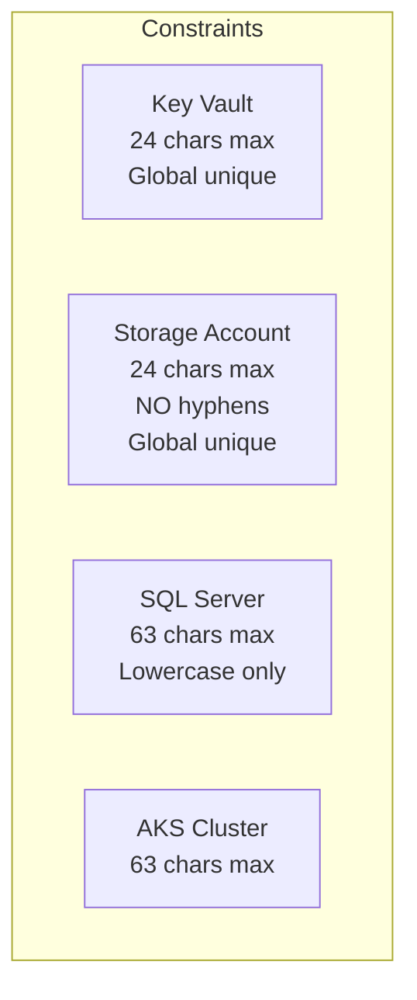

# Naming Conventions

Azure resource naming following [Microsoft's official abbreviations](https://learn.microsoft.com/en-us/azure/cloud-adoption-framework/ready/azure-best-practices/resource-abbreviations).

## Naming Pattern

```
{abbreviation}-{scope}-{environment}-{location}
```

Example: `kv-acme-prod-eastus` (Key Vault for ACME tenant in production East US)

## Critical Constraints



| Resource | Max Length | Hyphens | Scope |
|----------|------------|---------|-------|
| Key Vault | **24** | ✅ | Global |
| Storage Account | **24** | ❌ | Global |
| SQL Server | 63 | ✅ | Global |
| AKS Cluster | 63 | ✅ | Resource Group |
| VNet | 64 | ✅ | Resource Group |
| Resource Group | 90 | ✅ | Subscription |

## Azure Resource Abbreviations

### Core Infrastructure

| Resource | Abbreviation | Example |
|----------|--------------|---------|
| Resource Group | `rg` | `rg-platform-prod-eastus` |
| Management Group | `mg` | `mg-platform` |
| Subscription | `sub` | `sub-connectivity` |

### Networking

| Resource | Abbreviation | Example |
|----------|--------------|---------|
| Virtual Network | `vnet` | `vnet-hub-prod-eastus` |
| Subnet | `snet` | `snet-app` |
| Network Security Group | `nsg` | `nsg-app-prod-eastus` |
| Network Interface | `nic` | `nic-vm-prod-01` |
| Public IP Address | `pip` | `pip-agw-prod-eastus` |
| Private Endpoint | `pep` | `pep-kv-acme` |
| Route Table | `rt` | `rt-spoke-prod` |
| Virtual WAN | `vwan` | `vwan-hub-prod` |
| Virtual Hub | `vhub` | `vhub-prod-eastus` |
| VPN Gateway | `vpng` | `vpng-hub-prod-eastus` |
| ExpressRoute Gateway | `ergw` | `ergw-hub-prod-eastus` |
| Application Gateway | `agw` | `agw-app-prod-eastus` |
| Azure Firewall | `afw` | `afw-hub-prod-eastus` |
| Azure Bastion | `bas` | `bas-hub-prod-eastus` |
| Front Door | `afd` | `afd-global-prod` |

### Compute

| Resource | Abbreviation | Example |
|----------|--------------|---------|
| Virtual Machine | `vm` | `vm-web-prod-01` |
| VM Scale Set | `vmss` | `vmss-app-prod` |
| AKS Cluster | `aks` | `aks-prod-eastus` |
| AKS System Node Pool | `npsystem` | `npsystem` |
| AKS User Node Pool | `np` | `np-workload` |
| App Service Plan | `asp` | `asp-app-prod-eastus` |
| Web App | `app` | `app-api-prod-eastus` |
| Function App | `func` | `func-processor-prod` |
| Container Apps Env | `cae` | `cae-app-prod-eastus` |
| Container App | `ca` | `ca-api-prod` |
| Container Registry | `cr` | `crplatformprod` |

### Storage & Data

| Resource | Abbreviation | Example |
|----------|--------------|---------|
| Storage Account | `st` | `stplatformprodeastus` |
| Key Vault | `kv` | `kv-acme-prod-eastus` |
| SQL Server | `sql` | `sql-platform-prod-eastus` |
| SQL Database | `sqldb` | `sqldb-acme-prod` |
| PostgreSQL Server | `psql` | `psql-app-prod-eastus` |
| Cosmos DB | `cosmos` | `cosmos-app-prod-eastus` |
| Redis Cache | `redis` | `redis-app-prod-eastus` |

### Monitoring

| Resource | Abbreviation | Example |
|----------|--------------|---------|
| Log Analytics Workspace | `log` | `log-platform-prod-eastus` |
| Application Insights | `appi` | `appi-platform-prod-eastus` |
| Action Group | `ag` | `ag-ops-prod` |
| Automation Account | `aa` | `aa-platform-prod-eastus` |
| Recovery Services Vault | `rsv` | `rsv-platform-prod-eastus` |

### Identity

| Resource | Abbreviation | Example |
|----------|--------------|---------|
| Managed Identity | `id` | `id-acme-prod-eastus` |

## Layer-Based Naming

### Platform Layer (No Tenant)

Pattern: `{abbr}-platform-{env}-{location}`

```
rg-platform-prod-eastus
vnet-hub-prod-eastus
aks-platform-prod-eastus
kv-platform-prod-eastus
log-platform-prod-eastus
sql-platform-prod-eastus
```

### Services Layer (No Tenant)

Pattern: `{abbr}-svc-{env}-{location}`

```
# Kubernetes namespaces/services
grafana-svc-prod
kyverno-svc-prod
opensearch-svc-prod
```

### Application Layer (With Tenant)

Pattern: `{abbr}-{tenant}-{env}-{location}`

```
rg-app-acme-prod-eastus
kv-acme-prod-eastus           # 19 chars ✅
sqldb-acme-prod               # Database name
id-acme-prod-eastus           # Managed Identity
pep-kv-acme                   # Private Endpoint
```

## Safe Truncation

If name exceeds max length, truncate intelligently:

```
Original:  kv-verylongtenantname-prod-eastus (35 chars)
Truncated: kv-verylong...d-eastus            (24 chars)
           └─────┬────┘  └────┬────┘
           Keep start    Keep end
```

## Implementation

Use centralized functions in `packages/core/lib/naming.ts`:

```typescript
import { platformResourceName, applicationResourceName } from "@enterprise/core";

// Platform layer
platformResourceName("kv", "prod", "eastus")
// → "kv-platform-prod-eastus"

// Application layer
applicationResourceName("kv", "acme", "prod", "eastus")
// → "kv-acme-prod-eastus"

// Storage account (no hyphens)
applicationResourceName("st", "acme", "prod", "eastus")
// → "stacmeprodeastus"
```

## Validation

```typescript
import { validateResourceName } from "@enterprise/core";

validateResourceName("kv-acme-prod-eastus", "kv")
// → { valid: true }

validateResourceName("kv-acme-production-eastus", "kv")
// → { valid: false, error: "Name too long (max 24 chars)" }
```

## Best Practices

✅ **DO:**
- Use official Azure abbreviations
- Use centralized naming functions
- Validate names before creating resources
- Keep environment short (dev, stg, prod)
- Use lowercase for all resource names

❌ **DON'T:**
- Hardcode resource names
- Use special characters except hyphens
- Forget Storage Account doesn't allow hyphens
- Create resources manually outside Pulumi
- Use different patterns per environment

## Reference

- [Azure Naming Rules](https://docs.microsoft.com/en-us/azure/azure-resource-manager/management/resource-name-rules)
- [Azure Abbreviations](https://learn.microsoft.com/en-us/azure/cloud-adoption-framework/ready/azure-best-practices/resource-abbreviations)
