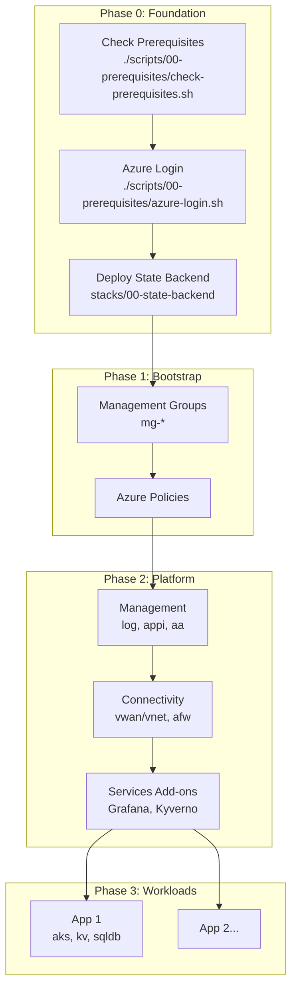
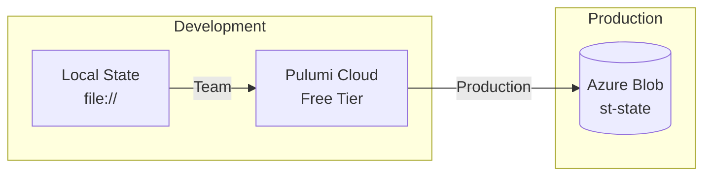

# Implementation Guide

Step-by-step guide for deploying the Azure Landing Zone.

## Deployment Flow



## Deployment Phases

| Phase | Document | Description |
|-------|----------|-------------|
| 0 | [Prerequisites](./prerequisites.md) | Tools, permissions, accounts |
| 0 | [State Backend](./state-backend.md) | Pulumi state storage |
| 1 | [Bootstrap](./bootstrap-guide.md) | Management groups, policies |
| 2 | [Platform](./platform-deployment.md) | Shared infrastructure |
| 3 | [Workloads](./workload-deployment.md) | Application landing zones |

## Reference

| Document | Description |
|----------|-------------|
| [Configuration Reference](./configuration-reference.md) | Full configuration schema |

## Quick Start

```bash
# 1. Check prerequisites
./scripts/00-prerequisites/check-prerequisites.sh

# 2. Login to Azure
./scripts/00-prerequisites/azure-login.sh

# 3. Configure
cp config/examples/minimal-payg-single.yaml config/landing-zone.yaml
# Edit with your subscription IDs

# 4. Deploy all phases
./scripts/02-state-management/deploy-all.sh
```

## State Backend Options



| Backend | Use Case | Setup |
|---------|----------|-------|
| Local | Solo development | `pulumi login file://` |
| Pulumi Cloud | Team collaboration | `pulumi login` |
| Azure Blob | Production | Deploy `00-state-backend` |

See [State Backend](./state-backend.md) for detailed setup.

## Incremental Deployment

Deploy specific phases only:

```bash
# Bootstrap only
./scripts/02-state-management/deploy-all.sh --phase bootstrap

# Platform only (requires bootstrap)
./scripts/02-state-management/deploy-all.sh --phase platform

# Single workload
./scripts/02-state-management/deploy-workload.sh --app my-app
```

## Environment Differences

| Config | Dev | Staging | Prod |
|--------|-----|---------|------|
| AKS nodes | 1 | 2 | 3+ |
| VM size | Standard_B2s | Standard_B2s | Standard_D4s_v3 |
| SQL tier | Basic | S1 | S3 |
| DR level | low | medium | high |
| Backups | 7 days | 14 days | 30 days |
| Monitoring | basic | full | full + alerting |

## Related

- [Architecture Overview](../architecture/index.md)
- [Developer Guide](../development/index.md)
