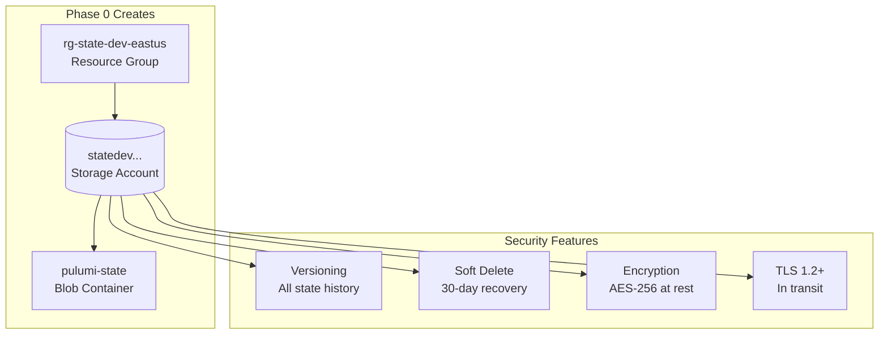

# State Backend

Pulumi state management strategy for secure and reliable deployments.

## Overview: Two-Tier State Management (Option A)

This project uses a **two-tier state management** approach to solve the bootstrap chicken-and-egg problem:

```
┌─────────────────────────────────────────────────────────────────────┐
│                     STATE MANAGEMENT ARCHITECTURE                   │
├─────────────────────────────────────────────────────────────────────┤
│                                                                     │
│   TIER 1: LOCAL STATE                 TIER 2: AZURE BLOB STATE     │
│   (~/.pulumi-local/)                  (Azure Storage Account)       │
│                                                                     │
│   ┌───────────────────────┐           ┌───────────────────────┐    │
│   │ 00-state-backend      │           │ 01-bootstrap          │    │
│   │                       │  creates  │ 02-platform-services  │    │
│   │ • Small (~few KB)     │ ────────► │ 03-services-addons    │    │
│   │ • Rarely changes      │           │ 04-application-svc    │    │
│   │ • Bootstrap only      │           │                       │    │
│   │ • BACKUP THIS!        │           │ • All production state│    │
│   └───────────────────────┘           │ • Team collaboration  │    │
│                                       │ • Versioning & backup │    │
│                                       └───────────────────────┘    │
│                                                                     │
└─────────────────────────────────────────────────────────────────────┘
```

### Why Two-Tier?

**The Chicken-and-Egg Problem:**
1. We want to store Pulumi state in Azure Blob Storage
2. But Azure Blob Storage doesn't exist yet
3. We need to deploy infrastructure to create it
4. Deploying infrastructure requires state storage

**Solution:**
1. Use local state to deploy Phase 0 (state backend)
2. Phase 0 creates Azure Storage Account
3. Switch to Azure Blob for all other phases
4. Keep local state as bootstrap recovery key

## State Backend Comparison

| Feature | Local State | Azure Blob |
|---------|-------------|------------|
| **Use Case** | Phase 0 bootstrap only | Phase 1+ production |
| **Location** | `~/.pulumi-local/` | Azure Storage Account |
| **Size** | ~few KB | Unlimited |
| **Backup** | Manual (REQUIRED!) | Built-in versioning |
| **Encryption** | None | AES-256 |
| **Team Access** | Single machine | Shared via Azure |
| **Cost** | Free | ~$5-20/month |

## Setup Guide

### Step 1: Create Local State Directory

```bash
# Create dedicated directory for bootstrap state
mkdir -p ~/.pulumi-local

# This directory will contain:
# ~/.pulumi-local/
# └── .pulumi/
#     └── stacks/
#         └── state-backend/
#             └── dev-eastus.json  ← Phase 0 state
```

### Step 2: Deploy Phase 0 (Local State)

```bash
# Login to local state
pulumi login file://~/.pulumi-local

# Deploy state backend
cd stacks/00-state-backend
pulumi stack init dev-eastus
pulumi config set azure-native:location eastus
pulumi up

# Verify deployment
pulumi stack output storageAccountName
pulumi stack output containerName
```

### Step 3: Switch to Azure Blob State

```bash
# Get storage account details (still in 00-state-backend directory)
export STORAGE_ACCOUNT=$(pulumi stack output storageAccountName)
export CONTAINER_NAME=$(pulumi stack output containerName)

# Get storage account key for authentication
export AZURE_STORAGE_KEY=$(az storage account keys list \
  --account-name $STORAGE_ACCOUNT \
  --query '[0].value' -o tsv)

# Switch to Azure Blob backend
cd ..  # Back to stacks/
pulumi logout
pulumi login azblob://${STORAGE_ACCOUNT}/${CONTAINER_NAME}

# Verify connection
pulumi whoami -v
```

### Step 4: Deploy Remaining Phases

```bash
# All subsequent phases use Azure Blob state
cd 01-bootstrap/management-groups
pulumi stack init bootstrap
pulumi up

# Continue with other phases...
```

## Azure Blob Storage Architecture



### Resources Created by Phase 0

| Resource | Naming | Purpose |
|----------|--------|---------|
| Resource Group | `rg-state-{env}-{location}` | Container for state resources |
| Storage Account | `ststate{env}{random}` | Blob storage (no hyphens allowed) |
| Blob Container | `pulumi-state` | State files container |

### Security Configuration

- **Versioning**: Enabled - preserves all state versions
- **Soft Delete**: 30-day retention for recovery
- **Encryption**: AES-256 service-side encryption
- **Access**: Storage Account Key or Azure AD (configurable)
- **Network**: Public access (can add Private Endpoint)

## Backup Strategy

### Local State Backup (CRITICAL!)

```bash
# Backup local state directory
cp -r ~/.pulumi-local ~/.pulumi-local-backup-$(date +%Y%m%d)

# Or create compressed archive
tar -czf pulumi-local-backup-$(date +%Y%m%d).tar.gz ~/.pulumi-local
```

**When to backup:**
- After initial Phase 0 deployment
- Before any changes to Phase 0
- Periodically (monthly recommended)

### Azure Blob State Backup

Azure Blob versioning automatically preserves state history. Manual backup:

```bash
# Export current state
pulumi stack export --stack dev-eastus > state-backup.json

# List available versions in Azure
az storage blob list \
  --account-name $STORAGE_ACCOUNT \
  --container-name pulumi-state \
  --include v  # Include versions
```

## State Recovery

### Scenario 1: Lost Local State (Phase 0)

If you lose `~/.pulumi-local/`:

```bash
# Option A: Restore from backup
cp -r ~/.pulumi-local-backup ~/.pulumi-local

# Option B: Import existing resources (if Azure resources still exist)
pulumi login file://~/.pulumi-local
cd stacks/00-state-backend
pulumi stack init dev-eastus

# Import existing resources manually
pulumi import azure-native:resources:ResourceGroup rg-state \
  /subscriptions/{sub-id}/resourceGroups/rg-state-dev-eastus

pulumi import azure-native:storage:StorageAccount ststate \
  /subscriptions/{sub-id}/resourceGroups/rg-state-dev-eastus/providers/Microsoft.Storage/storageAccounts/{account-name}
```

### Scenario 2: Corrupted Azure Blob State

```bash
# Restore from previous version
az storage blob download \
  --account-name $STORAGE_ACCOUNT \
  --container-name pulumi-state \
  --name ".pulumi/stacks/dev-eastus.json" \
  --version-id "2024-01-15T10:30:00Z" \
  --file state-restored.json

# Import restored state
pulumi stack import < state-restored.json
```

## Switching Between Backends

### From Local to Azure Blob

```bash
# Already logged into local
pulumi logout
pulumi login azblob://${STORAGE_ACCOUNT}/${CONTAINER_NAME}
```

### From Azure Blob to Local

```bash
# Already logged into Azure Blob
pulumi logout
pulumi login file://~/.pulumi-local
```

## Troubleshooting

### "No credentials found" for Azure Blob

```bash
# Ensure AZURE_STORAGE_KEY is set
export AZURE_STORAGE_KEY=$(az storage account keys list \
  --account-name $STORAGE_ACCOUNT \
  --query '[0].value' -o tsv)

# Or use Azure AD authentication
az login
export AZURE_STORAGE_USE_AZUREAD=true
```

### State Lock Issues

```bash
# Cancel stuck operation
pulumi cancel

# Force unlock (use with caution!)
pulumi cancel --force
```

### Check Current Backend

```bash
# Show current login
pulumi whoami -v

# Output examples:
# Local:      file://~/.pulumi-local
# Azure Blob: azblob://ststatedev.../pulumi-state
```

## Git Ignore Configuration

Add to `.gitignore`:

```gitignore
# Pulumi local state (stored in ~/.pulumi-local, not in repo)
.pulumi/
**/.pulumi/

# Stack configuration with secrets
Pulumi.*.yaml
!Pulumi.yaml
```

## Summary

| Phase | State Backend | Location | Action |
|-------|--------------|----------|--------|
| 0 | Local | `~/.pulumi-local/` | Backup manually |
| 1+ | Azure Blob | Storage Account | Auto-versioned |

**Key Points:**
1. Phase 0 always uses local state (bootstrap)
2. Phase 1+ always uses Azure Blob (production)
3. Backup local state directory (`~/.pulumi-local/`)
4. Never migrate Phase 0 to Azure Blob (circular dependency)

## Related

- [Prerequisites](./prerequisites.md)
- [Bootstrap Guide](./bootstrap-guide.md)
- [User Guide](../user-guide.md)
