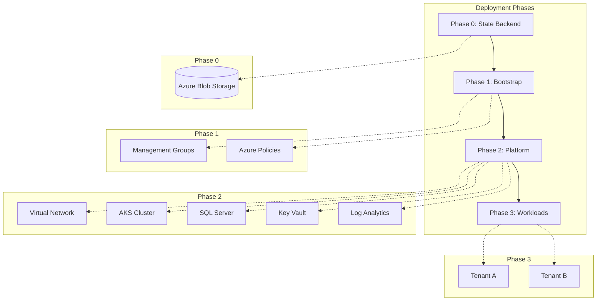

# Azure Landing Zone - Pulumi Implementation

Enterprise-scale Azure Landing Zone with multi-tenant, multi-region architecture using Pulumi TypeScript.

## Quick Links

| Document | Description |
|----------|-------------|
| **[User Guide](./user-guide.md)** | Step-by-step deployment instructions |
| [Architecture](./architecture/index.md) | Landing zone concepts and patterns |
| [Implementation](./implementation/index.md) | Detailed deployment guides |
| [Development](./development/index.md) | Developer guide for extending |

## Architecture Overview



## Project Structure

```
├── packages/core/          # Shared library
├── stacks/
│   ├── 00-state-backend/           # Phase 0: State storage
│   ├── 01-bootstrap/               # Phase 1: Governance
│   │   ├── management-groups/
│   │   └── policies/
│   ├── 02-platform-services/       # Phase 2: Shared infrastructure
│   ├── 03-services-addons/         # Phase 2.5: K8s add-ons
│   └── 04-application-services/    # Phase 3: Tenant resources
├── config/examples/        # Configuration templates
└── docs/                   # Documentation
```

## Getting Started

### Prerequisites

- Node.js >= 18
- pnpm >= 8
- Pulumi CLI >= 3
- Azure CLI >= 2.50

### Quick Start

```bash
# 1. Install dependencies
pnpm install && pnpm -r build

# 2. Create configuration
cp config/examples/minimal-payg-single.yaml config/landing-zone.yaml
# Edit config/landing-zone.yaml with your subscription IDs

# 3. Deploy (see User Guide for detailed steps)
cd stacks/00-state-backend && pulumi up
cd ../01-bootstrap/management-groups && pulumi up
cd ../policies && pulumi up
cd ../../02-platform-services && pulumi up
cd ../03-services-addons && pulumi up
cd ../04-application-services && pulumi up
```

See **[User Guide](./user-guide.md)** for complete instructions.

## Stack Summary

| Stack | Phase | Description |
|-------|-------|-------------|
| `00-state-backend` | 0 | Pulumi state storage |
| `01-bootstrap/management-groups` | 1 | Management group hierarchy |
| `01-bootstrap/policies` | 1 | Azure Policy assignments |
| `02-platform-services` | 2 | Shared infrastructure |
| `03-services-addons` | 2.5 | Kubernetes add-ons (Grafana, Kyverno) |
| `04-application-services` | 3 | Per-tenant resources |

## Configuration Defaults

| Setting | Default | Options |
|---------|---------|---------|
| `billing.model` | `PAYG` | PAYG, EA, MCA |
| `region.mode` | `single` | single, multi |
| `connectivity.architecture` | `hub-spoke` | hub-spoke, vwan |
| `workloads.defaults.computeType` | `aks` | aks, appservice, container-apps |

## Related Documentation

- [Azure Landing Zones](https://learn.microsoft.com/azure/cloud-adoption-framework/ready/landing-zone/)
- [Azure Naming Conventions](https://learn.microsoft.com/azure/cloud-adoption-framework/ready/azure-best-practices/resource-abbreviations)
- [Pulumi Azure Native Provider](https://www.pulumi.com/registry/packages/azure-native/)
