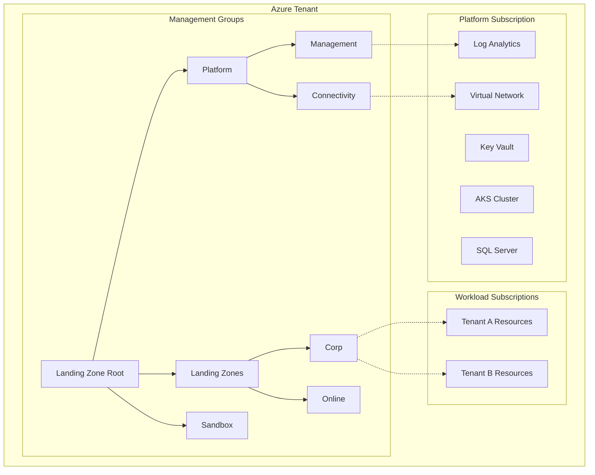
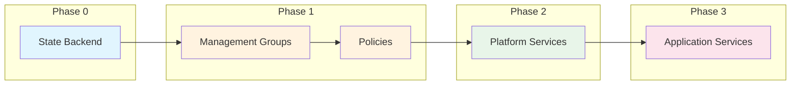
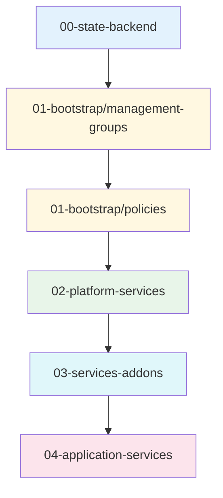
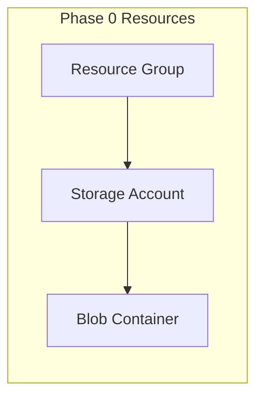
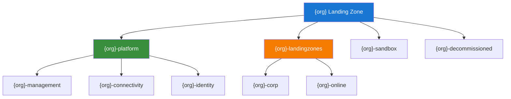
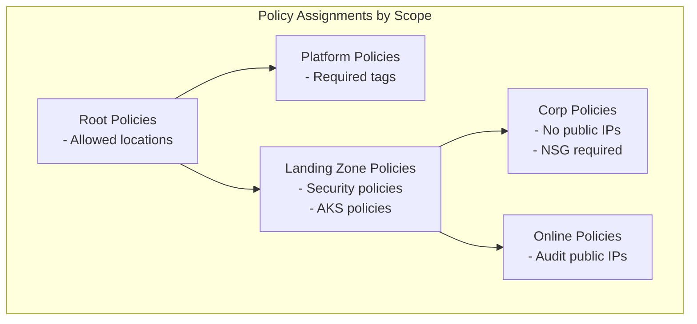
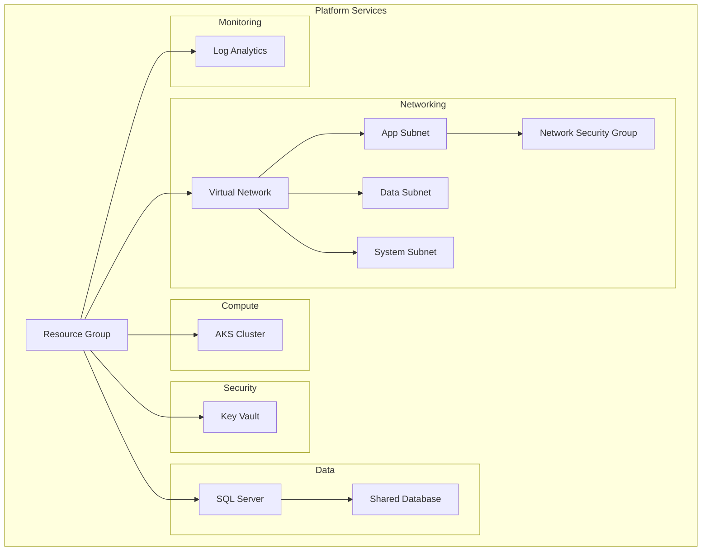
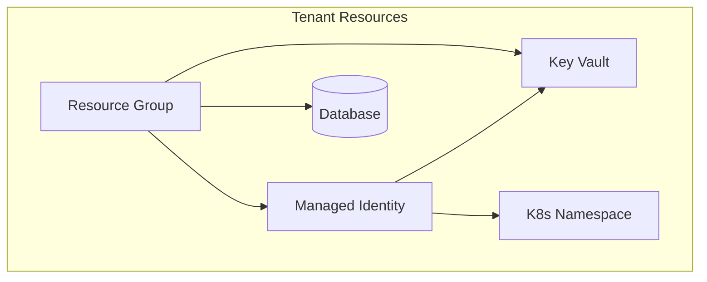

# Azure Landing Zone - User Guide

A step-by-step guide to deploy an enterprise-scale Azure Landing Zone using Pulumi TypeScript.

## Table of Contents

1. [Overview](#overview)
2. [Architecture](#architecture)
3. [Project Structure](#project-structure)
4. [Prerequisites](#prerequisites)
5. [Quick Start (Script-Based)](#quick-start-script-based---recommended)
6. [Deployment Workflows](#deployment-workflows)
7. [Manual Deployment](#manual-deployment-alternative)
8. [Deployment Phases](#deployment-phases)
9. [Configuration](#configuration)
10. [Common Operations](#common-operations)
11. [Troubleshooting](#troubleshooting)

---

## Overview

This project implements Microsoft's Cloud Adoption Framework (CAF) Azure Landing Zone architecture using Pulumi Infrastructure as Code.

### What You'll Deploy



---

## Architecture

### Deployment Flow

The deployment follows 4 sequential phases:



### Phase Summary

| Phase | Stack | Purpose | Dependencies |
|-------|-------|---------|--------------|
| 0 | `00-state-backend` | Pulumi state storage | None |
| 1a | `01-bootstrap/management-groups` | Management group hierarchy | Phase 0 |
| 1b | `01-bootstrap/policies` | Azure Policy assignments | Phase 1a |
| 2 | `02-platform-services` | Shared infrastructure (AKS, SQL, VNet) | Phase 1 |
| 2.5 | `03-services-addons` | Kubernetes add-ons (Grafana, Kyverno) | Phase 2 |
| 3 | `04-application-services` | Per-tenant resources | Phase 2.5 |

### State Management Strategy

This project uses **Option A: Two-tier state management**:

```
┌─────────────────────────────────────────────────────────────────────┐
│                     STATE MANAGEMENT ARCHITECTURE                   │
├─────────────────────────────────────────────────────────────────────┤
│                                                                     │
│  LOCAL STATE (~/.pulumi-local/)     AZURE BLOB STATE               │
│  ┌─────────────────────────────┐    ┌─────────────────────────────┐│
│  │  00-state-backend           │    │  01-bootstrap               ││
│  │  └── dev-eastus.json        │    │  02-platform-services       ││
│  │                             │    │  03-services-addons         ││
│  │  (Bootstrap state - small,  │    │  04-application-services    ││
│  │   rarely changes, backup!)  │    │                             ││
│  └─────────────────────────────┘    │  (Production state - all    ││
│               │                     │   other phases)             ││
│               │ creates             └─────────────────────────────┘│
│               └──────────────────────────────────►                 │
│                                                                     │
└─────────────────────────────────────────────────────────────────────┘
```

**Why this approach?**
- Phase 0 creates Azure Storage Account for state storage
- We can't store Phase 0's state in storage that doesn't exist yet (chicken-and-egg)
- After Phase 0 completes, all other phases use Azure Blob
- Local state is small (~few KB), rarely changes, acts as bootstrap recovery key

**Important:** Backup `~/.pulumi-local/` directory - it's needed to manage Phase 0.

---

## Project Structure

```
pulumi-cloud-native-enterprise-platform/
│
├── packages/
│   └── core/                          # Shared TypeScript library
│       └── lib/
│           ├── naming.ts              # Resource naming functions
│           ├── tagging.ts             # Tagging functions
│           ├── interfaces.ts          # Type definitions
│           └── config/                # Configuration loader
│               ├── schema.ts          # Config interfaces
│               └── loader.ts          # YAML loader
│
├── stacks/                            # Pulumi stacks (deployable units)
│   │
│   ├── 00-state-backend/              # Phase 0: State storage
│   │   ├── index.ts
│   │   ├── Pulumi.yaml
│   │   └── package.json
│   │
│   ├── 01-bootstrap/                  # Phase 1: Bootstrap
│   │   ├── management-groups/         # Management group hierarchy
│   │   │   ├── index.ts
│   │   │   ├── management-groups.ts   # MG component
│   │   │   └── Pulumi.yaml
│   │   │
│   │   └── policies/                  # Azure Policy assignments
│   │       ├── index.ts
│   │       ├── policy-definitions.ts  # Policy definitions
│   │       ├── policy-assignments.ts  # Assignment component
│   │       └── Pulumi.yaml
│   │
│   ├── 02-platform-services/          # Phase 2: Platform infrastructure
│   │   ├── index.ts                   # VNet, AKS, SQL, KeyVault
│   │   └── Pulumi.yaml
│   │
│   ├── 03-services-addons/            # Phase 2.5: Kubernetes add-ons
│   │   ├── index.ts                   # Grafana, Kyverno, monitoring
│   │   └── Pulumi.yaml
│   │
│   └── 04-application-services/       # Phase 3: Tenant resources
│       ├── index.ts                   # Per-tenant KeyVault, DB, identity
│       └── Pulumi.yaml
│
├── config/                            # Configuration files
│   └── examples/
│       ├── minimal-payg-single.yaml   # Simple PAYG setup
│       ├── enterprise-ea-multi.yaml   # Enterprise multi-region
│       └── development-local.yaml     # Development setup
│
├── scripts/                           # Automation scripts
│   ├── 00-prerequisites/              # Tools, Azure login, checks
│   ├── 01-azure-setup/                # Azure-specific setup (subscriptions, permissions)
│   ├── 02-state-management/           # Pulumi deployment orchestration
│   └── 99-utilities/                  # Common utilities
│
└── docs/                              # Documentation
```

### Stack Dependencies



---

## Prerequisites

### Required Tools

| Tool | Version | Installation |
|------|---------|--------------|
| Node.js | >= 18 | [nodejs.org](https://nodejs.org) |
| pnpm | >= 8 | `npm install -g pnpm` |
| Pulumi CLI | >= 3 | [pulumi.com/docs/install](https://www.pulumi.com/docs/install/) |
| Azure CLI | >= 2.50 | [docs.microsoft.com](https://docs.microsoft.com/cli/azure/install-azure-cli) |

### Azure Permissions

| Phase | Required Role |
|-------|--------------|
| 0 (State) | Contributor on subscription |
| 1 (Bootstrap) | Management Group Contributor at tenant root |
| 2 (Platform) | Owner on platform subscription |
| 3 (Application) | Contributor on workload subscription |

### Verify Prerequisites

```bash
# Check Node.js
node --version  # Should be >= 18

# Check pnpm
pnpm --version  # Should be >= 8

# Check Pulumi
pulumi version  # Should be >= 3

# Check Azure CLI and login
az --version
az login
az account show
```

---

## Quick Start (Script-Based - Recommended)

The recommended way to deploy the landing zone is using automation scripts. These handle state management switching automatically.

### 1. Clone and Setup

```bash
# Clone repository
git clone <repository-url>
cd pulumi-cloud-native-enterprise-platform

# Install dependencies
pnpm install

# Build all packages
pnpm -r build
```

### 2. Check Prerequisites

```bash
# Check all required tools are installed
./scripts/00-prerequisites/check-prerequisites.sh

# Install missing tools (macOS/Linux)
./scripts/00-prerequisites/install-tools.sh

# Login to Azure
./scripts/00-prerequisites/azure-login.sh
```

### 3. Configure Subscriptions

```bash
# Interactive subscription setup
# - Lists your existing subscriptions
# - Validates subscription IDs
# - Registers required resource providers
# - Generates configuration file
./scripts/01-azure-setup/create-subscriptions-payg.sh
```

> **Note:** PAYG subscriptions must be created through Azure Portal (Azure limitation). The script helps configure them after creation.

### 4. Deploy All Phases

```bash
# Deploy everything (Phase 0 through Phase 3)
./scripts/02-state-management/deploy-all.sh --include-phase0

# Or with options:
./scripts/02-state-management/deploy-all.sh --include-phase0 --env prod --region westus --yes
```

### 5. Verify Deployment

```bash
# Check current Pulumi backend
pulumi whoami -v

# List deployed stacks
pulumi stack ls
```

### Available Deployment Scripts

| Script | Description |
|--------|-------------|
| `deploy-phase0.sh` | Deploy Phase 0 with local state |
| `switch-to-azure-state.sh` | Switch Pulumi to Azure Blob state |
| `deploy-all.sh` | Deploy all phases (1-3 by default) |
| `deploy-all.sh --include-phase0` | Deploy all phases including Phase 0 |
| `destroy-all.sh` | Destroy all phases in reverse order |

### Script Options

```bash
./scripts/02-state-management/deploy-all.sh --help

Options:
  --phase PHASE      Deploy specific phase: phase0, bootstrap, platform, workloads, all
  --include-phase0   Include Phase 0 in 'all' deployment
  --env ENV          Environment name (default: dev)
  --region REGION    Azure region (default: eastus)
  --dry-run          Preview changes without deploying
  --yes, -y          Skip confirmation prompts
```

---

## Deployment Workflows

This project supports two deployment workflows: **Script-Based** (for teams) and **Manual** (for learning/debugging). Choose the approach that fits your needs.

### Scripts Folder Organization

```
scripts/
├── 00-prerequisites/              # Tools & Azure login
│   ├── check-prerequisites.sh     # Verify all tools installed
│   ├── install-tools.sh           # Install missing tools
│   └── azure-login.sh             # Azure CLI authentication
│
├── 01-azure-setup/                # Azure-specific setup
│   ├── get-enrollment-account.sh  # EA enrollment (Enterprise only)
│   ├── create-subscriptions-payg.sh # PAYG subscription config
│   └── validate-permissions.sh    # Check Azure permissions
│
├── 02-state-management/           # Pulumi deployment orchestration
│   ├── deploy-phase0.sh           # Deploy state backend (local state)
│   ├── switch-to-azure-state.sh   # Switch to Azure Blob state
│   ├── deploy-all.sh              # Orchestrate all phases
│   ├── deploy-workload.sh         # Deploy individual workload
│   └── destroy-all.sh             # Cleanup all phases
│
└── 99-utilities/
    ├── common.sh                  # Shared functions
    └── validate-config.sh         # Configuration validation
```

### Team Workflow (Using Scripts) - Recommended

When working as a team, use the automation scripts. **Team members do not need to run Pulumi commands manually.**

```bash
# Developer just runs:
./scripts/02-state-management/deploy-all.sh --include-phase0 --env dev --region eastus --yes
```

**What the script automatically handles:**

| Step | Action | Manual Equivalent |
|------|--------|-------------------|
| 1 | Creates local state directory (`~/.pulumi-local/`) | `mkdir -p ~/.pulumi-local` |
| 2 | Logs into local state for Phase 0 | `pulumi login file://~/.pulumi-local` |
| 3 | Deploys state backend (Storage Account) | `pulumi up` in `stacks/00-state-backend` |
| 4 | Switches to Azure Blob state | `pulumi logout && pulumi login azblob://...` |
| 5 | Deploys all remaining phases in correct order | Multiple `pulumi up` commands |
| 6 | Saves state info for future use | Export environment variables |

**Benefits for teams:**
- ✅ Consistent deployment across all team members
- ✅ No manual errors (forgetting to switch state backend)
- ✅ New team members can deploy without deep knowledge
- ✅ Ready for CI/CD pipelines (GitHub Actions, Azure DevOps)

**Team commands:**

```bash
# First time setup (includes Phase 0)
./scripts/02-state-management/deploy-all.sh --include-phase0

# Daily deployments (Phase 1-3 only, Phase 0 already exists)
./scripts/02-state-management/deploy-all.sh

# Deploy specific phase
./scripts/02-state-management/deploy-all.sh --phase platform

# Add new workload/tenant
./scripts/02-state-management/deploy-workload.sh --tenant acme

# Destroy everything
./scripts/02-state-management/destroy-all.sh --include-phase0
```

### Manual Workflow (Using Pulumi Commands)

For learning, debugging, or when you need full control over each step.

**Benefits for learning/debugging:**
- ✅ Understand each step deeply
- ✅ Full control over what happens
- ✅ Debug issues more easily
- ✅ Customize individual deployments

See the [Manual Deployment](#manual-deployment-alternative) section below for step-by-step commands.

### Workflow Decision Matrix

| Scenario | Use Scripts? | Run Pulumi Manually? |
|----------|-------------|---------------------|
| **Team deployment** | ✅ Yes | ❌ No |
| **CI/CD pipeline** | ✅ Yes | ❌ No |
| **Learning/Understanding** | ❌ No | ✅ Yes |
| **Debugging issues** | ❌ No | ✅ Yes |
| **First-time setup** | Either | Either |
| **Production deployment** | ✅ Yes | ❌ No |

### Understanding What Scripts Handle

The `02-state-management` scripts handle the complexity of **two-tier state management**:

```
┌─────────────────────────────────────────────────────────────────────────┐
│                    SCRIPT AUTOMATION FLOW                                │
├─────────────────────────────────────────────────────────────────────────┤
│                                                                         │
│  PHASE 0 (deploy-phase0.sh)          PHASE 1-3 (deploy-all.sh)         │
│  ┌─────────────────────────┐         ┌─────────────────────────┐       │
│  │ 1. Create ~/.pulumi-local│         │ 4. Read state backend   │       │
│  │ 2. pulumi login file://  │ ──────► │    info from Phase 0    │       │
│  │ 3. Deploy storage account│         │ 5. Get storage key      │       │
│  │    (creates Azure Blob)  │         │ 6. pulumi login azblob  │       │
│  └─────────────────────────┘         │ 7. Deploy all stacks    │       │
│         LOCAL STATE                   └─────────────────────────┘       │
│                                              AZURE BLOB STATE           │
│                                                                         │
└─────────────────────────────────────────────────────────────────────────┘
```

**Key insight:** You don't need to understand state backend switching if you use the scripts. The scripts handle:
- Which state backend each phase uses (local vs Azure Blob)
- The correct deployment order
- Environment variable setup
- Error handling and validation

---

## Manual Deployment (Alternative)

If you prefer manual control over each step, follow this guide.

### 1. Create Configuration

```bash
# Copy example configuration
cp config/examples/minimal-payg-single.yaml config/landing-zone.yaml

# Edit with your values (use your subscription ID from `az account show`)
# - platform.organization.name: your-org-name
# - platform.billing.subscriptions.management: your-subscription-id
# - platform.region.primary: eastus (or your preferred region)
```

### 2. Deploy Phase 0: State Backend (Local State)

Phase 0 uses local state to bootstrap the Azure Storage Account.

```bash
# Create local state directory
mkdir -p ~/.pulumi-local

# Login to local state (for Phase 0 only)
pulumi login file://~/.pulumi-local

# Deploy state backend
cd stacks/00-state-backend
pulumi stack init dev-eastus
pulumi config set azure-native:location eastus
pulumi up

# Verify outputs
pulumi stack output storageAccountName
pulumi stack output containerName
```

### 3. Switch to Azure Blob State

After Phase 0 creates the storage account, switch to Azure Blob for all remaining phases.

```bash
# Get storage account details (still in 00-state-backend directory)
export STORAGE_ACCOUNT=$(pulumi stack output storageAccountName)
export CONTAINER_NAME=$(pulumi stack output containerName)

# Get storage account key for authentication
export AZURE_STORAGE_KEY=$(az storage account keys list \
  --account-name $STORAGE_ACCOUNT \
  --query '[0].value' -o tsv)

# Switch Pulumi to Azure Blob backend
cd ..  # Back to stacks/
pulumi logout
pulumi login azblob://${STORAGE_ACCOUNT}/${CONTAINER_NAME}
```

### 4. Deploy Remaining Phases (Azure Blob State)

All subsequent phases use Azure Blob for state storage.

```bash
# Phase 1a: Management Groups
cd 01-bootstrap/management-groups
pulumi stack init bootstrap
pulumi up

# Phase 1b: Policies
cd ../policies
pulumi stack init bootstrap-policies
pulumi up

# Phase 2: Platform Services
cd ../../02-platform-services
pulumi stack init dev-eastus
pulumi config set azure-native:location eastus
pulumi config set infrastructure:environment dev
pulumi config set --secret sql:adminPassword <your-secure-password>
pulumi up

# Phase 2.5: Services Add-ons
cd ../03-services-addons
pulumi stack init dev-eastus
pulumi config set infrastructure:environment dev
pulumi config set infrastructure:location eastus
pulumi up

# Phase 3: Application Services (per tenant)
cd ../04-application-services
pulumi stack init acme-prod-eastus
pulumi config set azure-native:location eastus
pulumi config set infrastructure:tenantId acme
pulumi config set infrastructure:environment prod
pulumi up
```

---

## Deployment Phases

### Phase 0: State Backend

**Purpose:** Create secure storage for Pulumi state files.

**What it creates:**
- Resource Group (`rg-state-{env}`)
- Storage Account (`ststate{env}`)
- Blob Container for state



**Deploy:**

```bash
cd stacks/00-state-backend
pulumi stack init dev-eastus
pulumi config set azure-native:location eastus
pulumi up
```

**Outputs:**
- `stateBackendUrl` - Use this for subsequent stacks

---

### Phase 1a: Management Groups

**Purpose:** Create the management group hierarchy for governance.

**What it creates:**



**Deploy:**

```bash
cd stacks/01-bootstrap/management-groups
pulumi stack init bootstrap
pulumi up
```

**Configuration options:**

```yaml
# In config/landing-zone.yaml
platform:
  organization:
    name: contoso              # Prefix for all MGs
    displayName: Contoso Corp
  managementGroups:
    includeIdentity: false     # Skip identity MG
    includeSandbox: true       # Include sandbox
    includeDecommissioned: true
```

---

### Phase 1b: Policies

**Purpose:** Assign Azure Policies for governance and compliance.

**What it creates:**



**Deploy:**

```bash
cd stacks/01-bootstrap/policies
pulumi stack init bootstrap-policies
pulumi config set enforceMode true  # or false for audit-only
pulumi up
```

---

### Phase 2: Platform Services

**Purpose:** Deploy shared infrastructure for all workloads.

**What it creates:**



**Deploy:**

```bash
cd stacks/02-platform-services
pulumi stack init dev-eastus
pulumi config set azure-native:location eastus
pulumi config set infrastructure:environment dev
pulumi config set --secret sql:adminPassword <secure-password>
pulumi up
```

**Key outputs:**
- `aksClusterId` - AKS cluster resource ID
- `kubeconfig` - Kubernetes configuration
- `keyVaultUri` - Key Vault URI
- `sqlServerFqdn` - SQL Server endpoint

---

### Phase 3: Application Services

**Purpose:** Deploy per-tenant resources.

**What it creates per tenant:**



**Deploy (for each tenant):**

```bash
cd stacks/04-application-services
pulumi stack init acme-prod-eastus
pulumi config set azure-native:location eastus
pulumi config set infrastructure:tenantId acme
pulumi config set infrastructure:environment prod
pulumi config set database:isolation isolated  # or "shared"
pulumi up
```

---

## Configuration

### Configuration File

Create `config/landing-zone.yaml`:

```yaml
platform:
  # Organization settings
  organization:
    name: contoso                    # Short name (max 10 chars)
    displayName: Contoso Corporation
    domain: contoso.com

  # Billing model
  billing:
    model: PAYG                      # PAYG | EA | MCA
    subscriptions:
      management: "xxxxxxxx-xxxx-xxxx-xxxx-xxxxxxxxxxxx"
      connectivity: "xxxxxxxx-xxxx-xxxx-xxxx-xxxxxxxxxxxx"

  # Region configuration
  region:
    mode: single                     # single | multi
    primary: eastus
    # secondary: westus              # Required if mode: multi

  # Management groups
  managementGroups:
    root: contoso
    includeIdentity: false
    includeSandbox: true
    includeDecommissioned: true

  # Connectivity
  connectivity:
    architecture: hub-spoke          # hub-spoke | vwan
    firewall:
      enabled: true
      sku: Standard

  # Management
  management:
    logRetentionDays: 30
    enableDefender: false

# Workloads
workloads:
  defaults:
    computeType: aks
    tier: corp
    networkIsolation: true

  applications:
    - name: payment-service
      tier: corp
      database:
        enabled: true
        type: postgresql
```

### Environment-Specific Settings

| Environment | AKS Nodes | SQL SKU | Log Retention | Defender |
|-------------|-----------|---------|---------------|----------|
| dev | 1 | Basic | 7 days | Off |
| staging | 2 | S1 | 14 days | Off |
| prod | 3+ | S3+ | 365 days | On |

---

## Common Operations

### Add a New Tenant

```bash
cd stacks/04-application-services

# Create new stack
pulumi stack init newtenant-prod-eastus

# Configure
pulumi config set azure-native:location eastus
pulumi config set infrastructure:tenantId newtenant
pulumi config set infrastructure:environment prod

# Deploy
pulumi up
```

### Update Platform Services

```bash
cd stacks/02-platform-services
pulumi stack select dev-eastus
pulumi up
```

### View Stack Outputs

```bash
pulumi stack output --show-secrets
```

### Destroy Resources

Using scripts (recommended):

```bash
# Destroy all phases except Phase 0
./scripts/02-state-management/destroy-all.sh

# Destroy everything including Phase 0
./scripts/02-state-management/destroy-all.sh --include-phase0

# Destroy specific phase only
./scripts/02-state-management/destroy-all.sh --phase workloads
./scripts/02-state-management/destroy-all.sh --phase platform
./scripts/02-state-management/destroy-all.sh --phase bootstrap

# Preview what will be destroyed
./scripts/02-state-management/destroy-all.sh --dry-run
```

Manual destruction (reverse order, switching state backends):

```bash
# ============================================================
# STEP 1: Destroy Phase 1-3 (using Azure Blob state)
# ============================================================
# Make sure you're logged into Azure Blob state
# pulumi login azblob://${STORAGE_ACCOUNT}/${CONTAINER_NAME}

cd stacks/04-application-services
pulumi destroy --yes

cd ../03-services-addons
pulumi destroy --yes

cd ../02-platform-services
pulumi destroy --yes

cd ../01-bootstrap/policies
pulumi destroy --yes

cd ../management-groups
pulumi destroy --yes

# ============================================================
# STEP 2: Switch to local state for Phase 0
# ============================================================
cd ../..
pulumi logout
pulumi login file://~/.pulumi-local

# ============================================================
# STEP 3: Destroy Phase 0 (state backend itself)
# ============================================================
cd 00-state-backend
pulumi destroy --yes

# After this, the Azure Storage Account is deleted
# Your local state in ~/.pulumi-local/ can be cleaned up
```

---

## Troubleshooting

### Common Issues

#### "Management Group already exists"

```bash
# Option 1: Import existing
pulumi import azure-native:management:ManagementGroup mg-name /providers/Microsoft.Management/managementGroups/mg-name

# Option 2: Change prefix in config
```

#### "Insufficient permissions"

```bash
# Check your current permissions
az role assignment list --assignee $(az account show --query user.name -o tsv)

# Verify management group access
az account management-group list
```

#### "Policy assignment failed"

```bash
# Register required providers
az provider register --namespace Microsoft.PolicyInsights
az provider register --namespace Microsoft.Management
```

#### "AKS cluster creation failed"

```bash
# Check quota
az vm list-usage --location eastus -o table

# Check AKS versions available
az aks get-versions --location eastus -o table
```

### Getting Help

1. Check Pulumi logs: `pulumi logs`
2. Enable verbose output: `pulumi up --verbose 3`
3. Check Azure Activity Log in Portal
4. Review [Pulumi Troubleshooting](https://www.pulumi.com/docs/troubleshooting/)

---

## Next Steps

1. **Customize policies** - Edit `stacks/01-bootstrap/policies/policy-definitions.ts`
2. **Add monitoring** - Configure alerts in Log Analytics
3. **Enable multi-region** - Set `region.mode: multi` in config
4. **Add workloads** - Create application stacks for your services

---

## Reference Links

- [Azure Landing Zones](https://docs.microsoft.com/azure/cloud-adoption-framework/ready/landing-zone/)
- [Pulumi Azure Native](https://www.pulumi.com/registry/packages/azure-native/)
- [Azure Naming Conventions](https://docs.microsoft.com/azure/cloud-adoption-framework/ready/azure-best-practices/resource-abbreviations)
